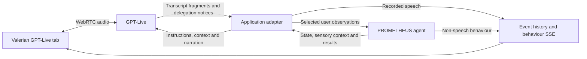

# PROMETHEUS GPT-Live cockpit proposal and roadmap

- Branch: `feature/gptlive`
- Baseline: `main` at `2104b11`, through project Milestone 183
- Created: 2026-09-27
- Status: GL-01 through GL-04 automated implementation complete (project Milestones
  184–187); GL-05 next. Live voice and physical acceptance remain NOT RUN.
- Target voice model: `gpt-live-1`, using client delegation.

The user authorized implementation on 2026-09-27: complete each milestone, commit
and push its changes, then continue to the next milestone. Halt only for an
unforeseen decision requiring user input. Follow `.agents/CODEX.md` and
`.agents/CONTEXT.MD`; this session instruction supersedes their ordinary stop-for-
review handoff. Assign project milestone numbers when work is implemented.

## 1. Proposed first version

Add an experimental **GPT-Live** tab beside **Text** and the existing
transcription/TTS speech tab in Valerian's interaction column. Preserve their
current behaviour and saved settings. The new tab provides continuous,
full-duplex conversation while PROMETHEUS processes observations and controls
tasks in the background.

The responsibilities are explicit:

- GPT-Live generates immediate speech and receives selected conversational and
  sensory context.
- PROMETHEUS owns agent identity, event history, state transitions, guards,
  actions, storage, task outcomes and non-speech behaviour.
- The application adapter translates between continuous provider activity and
  discrete agent events. It owns session lifecycle, provenance, deduplication
  and updates to the voice session.
- WebRTC carries microphone and speaker audio between browser and provider.
  A backend sideband observes transcripts and sends context and delegation
  results. Only the backend persists provider transcripts.



### Operator experience

- The tab is visible when the feature is enabled. Starting requires a connected,
  supported agent and an explicit **Start GPT-Live** click. Agent creation,
  connection, tab selection and page reload never start the microphone.
- Show session states: Idle, Connecting, Active, Stopping, Disconnected and Error.
  Show independent microphone/output activity; continuous speech has no reliable
  provider turn-completed indicator.
- Expose microphone, speaker and supported voice selection before start, with
  agent-language guidance. Reuse requested/applied capture settings and device
  preferences where their meanings match. Do not expose old Realtime VAD,
  response-create, output-token or TTS-speed settings as GPT-Live controls.
- Provide **Mute microphone** and **Stop GPT-Live**. Stop silences local output
  immediately, releases capture, invalidates pending work and begins bounded
  provider finalization. An input mute does not imply output mute or session end.
- Display independent growing user/assistant captions during overlap. Captions
  are provisional until the adapter records a segment. Reconcile them with
  persisted conversation entries rather than adding duplicate bubbles.
- The existing behaviour column continues rendering nonverbal, motion and display
  channels. Diagnostics show context revision, backend lag and incomplete capture;
  implementation details do not enter the ordinary conversation.
- Switching away from the active speech tab stops its session. Starting either
  speech mode tears down the other first. Text submission becomes available after
  that stop. Shared sensing can continue while the Live tab is active.
- Reuse microphone and per-agent output leases across modes and browser tabs.
  Enforce one active Live session per agent in the application instance. A second
  caller gets an actionable conflict, not another audible session.
- Reset, switch, delete, disconnect, logout and navigation synchronously invalidate
  local activity. No late event may hydrate or mutate a newly selected agent.
- v1 recovery is explicit **Reconnect**, creating a fresh session from current
  selected context. No silent replay of speech or transcript resubmission.

### Supported scope and defaults

- Feature flag defaults off. Use an explicit backend eligibility check; possessing
  an access code and a speech modality alone is insufficient to certify a policy.
- Pilot definitions: `core.multimodal_behaviour` for conversation/sensing,
  `core.role_clarification_guessing_game` for nested state changes, and
  `core.rock_scissor_paper` for deterministic visual-triggered behaviour. Confirm
  their current implementations in GL-01. Use small deterministic fixtures for
  branches that cannot be reliably forced through a production prompt.
- Preserve supported non-speech channels for eligible agents. Custom policies,
  exact-text Talk to Me and unreviewed healthcare workflows remain on the existing
  modes until explicitly certified; do not silently enable Live for every catalog
  definition or duplicate production agents just to demonstrate the integration.
- Full duplex is the default experiment. If acoustics fail, use the existing
  transcription/TTS tab as the visible fallback. Automatic half-duplex gating
  inside Live is deferred: it needs a separate output-activity policy and trials.
- Inherit the agent language. The proposed live acceptance languages are English
  and German until the operator identifies the deployment languages. Existing
  Arabic transcription support must remain unchanged.
- Keep the current output profiles and HTTP/SSE contracts. Do not resurrect
  `REALTIME_SPEECH`, `BACKEND_COMPLEMENT` or the deleted Realtime stack.
- Client delegation uses PROMETHEUS directly. Hosted Responses delegation,
  web search, generic function catalogs, arbitrary state-changing tools, image
  upload, diarization, telephony and a separate ASR stream are outside v1.
- Use one application instance for session coordination, matching existing runtime
  mutation locking. Distributed ownership and seamless failover are outside v1.

## 2. Confirmed decisions and remaining trial details

The following directions come from the conversation: a third tab; continued
availability of text and transcription/TTS; user and assistant speech retained in
history; asynchronous state guidance with accepted stale-instruction speech;
sensory context; and backend-initiated speech without a user utterance.

The user confirmed the following on 2026-09-27 while this plan was prepared:

| Decision | Confirmed v1 choice | Boundary |
| --- | --- | --- |
| History selection across transitions | Preserve the running voice conversation with explicit current-state updates. | Selection governs new context supplied by PROMETHEUS; it does not erase previously heard context. |
| Backend announcements | Allow paraphrasing in GPT-Live; keep intended text and actual generated speech distinguishable. | Exact wording remains in the existing text/TTS modes. |
| Physical acceptance setup | Chrome on Windows and Linux. First use built-in microphone/speakers; test Bluetooth-connected microphones/speakers later. | Record exact versions, device models and routing at each trial. Passing built-in audio does not pass the Bluetooth gate. |

No remaining product decision blocks the proposed v1 design. Exact device models,
Chrome/OS versions and trial languages are operational details to record before
each physical run. English/German remain proposed acceptance defaults, not a user
confirmation; the voice prompt follows the selected agent's language. All other
limits, pilot eligibility and test targets in this document are proposed engineering
defaults to validate through the milestones, not existing implementation claims.

## 3. Evidence and API constraints

Repository findings, verified against selected history and current code:

- `cd4b95c` / Milestone 53 introduced sideband orchestration and external speech
  recording. Milestone 54 documented a live duplicate-response bug and changed
  the design to backend-authored speech. Actor labels alone did not solve it.
- `25e8240` / Milestone 56 addressed duplicate/phantom transcript ingress.
- `e73610e` / Milestone 69 made visual-triggered backend speech audible.
- `26c8427` / Milestone 99 added duplex tuning and echo diagnostics.
- `c04435b` / Milestone 155 removed the combined stack and profile split.
- `.agents/TRANSCRIBE_SMOKE_RESULTS.md` records physical acoustic cases as
  `NOT RUN`. These records do not establish Bluetooth echo as the root cause.

Recheck the following official contracts at GL-01 and before implementing each
provider boundary. The July announcement alone is not an API specification.

| Source | Constraint relevant to this plan |
| --- | --- |
| [Model](https://developers.openai.com/api/docs/models/gpt-live-1) | API model identifier and full-duplex capability. Account access still needs verification. |
| [WebRTC](https://developers.openai.com/api/docs/guides/voice-webrtc?api=live) | Backend exchanges SDP through `POST /v1/live/sessions`; audio uses media tracks. Keep credentials server-side. |
| [Server controls](https://developers.openai.com/api/docs/guides/voice-server-controls?api=live) | Attach by session ID. Reflected audio permits investigation; output timing is not proof of audibility. |
| [Session management](https://developers.openai.com/api/docs/guides/live-conversations) | Transcript deltas have timing but no completed-turn/item contract. Startup history is bounded; context appends are limited to 500 tokens. Appends do not erase prior history. |
| [Delegation](https://developers.openai.com/api/docs/guides/live-delegation) | Client notifications carry metadata, not utterance arguments. The application supplies context and returns results. |
| [Migration](https://developers.openai.com/api/docs/guides/live-migration) | Old manual commit/voice-response triggers do not transfer. Speech can overlap backend work. |
| [Prompting](https://developers.openai.com/api/docs/guides/live-prompting) | Separate voice guidance from task procedures; delegate before claiming backend results. |
| [Costs](https://developers.openai.com/api/docs/guides/voice-latency-cost?api=live) | Measure session duration and backend cost separately, including startup and idle time. |

## 4. Integration contracts

### Scoped session and execution ownership

Introduce a typed, scoped Live-session service, provider gateway and sideband
adapter under the existing application/controllers/SPI boundaries. Proposed API
namespace: `/demo/agents/{agentId}/live/...`; finalize exact DTOs in GL-01 using
the existing error and access-code conventions. Browser commands use a local
session handle bound to agent, access scope and execution epoch, not an arbitrary
provider session ID. Validate settings and bound SDP size, connection time,
queues and session lifetime. Keep credentials, SDP and audio out of ordinary logs.

Creation must install handlers and attach the backend before conversational input
is admitted. Define an event-buffer/readiness handshake for the startup interval;
an unobserved startup gap cannot be treated as complete transcript capture. Browser
captions never constitute a second persistence writer. Restrict frontend provider
control permissions where supported. On sideband loss, stop the Live experience
and report incomplete capture instead of letting speech silently diverge from
PROMETHEUS. Close orphaned provider sessions after partial startup failure.

All agent mutations, including ticks, sensory events, external speech recording
and reset/delete, use existing per-agent serialization. Provider I/O and context
delivery occur outside the agent lock, using immutable snapshots captured after
commit. Completion checks session/agent epochs and revisions before applying work.
No persistence entities are passed to background workers.

### Continuous transcripts and discrete events

Keep ordered fragment receipts for each speaker with provider event ID when
present, session-relative interval, arrival time and application sequence.
Deduplicate by identity, never by text: repeated words can be legitimate. Preserve
overlap and arrival order separately from the monotonic persisted event order.

GL-01 must establish a defensible speech-activity/timeline input. GL-04 implements
a deterministic, bounded segmenter against that contract. An initial experiment
uses 800 ms of observed input inactivity plus 400 ms transcript-lateness grace;
these are provisional test parameters, not model turn boundaries or certified
healthcare settings. A network gap alone never closes a segment. Long continuous
speech must reach a configured bounded diagnostic state rather than grow an
unbounded buffer or silently trigger actions on an arbitrary cutoff.

Freeze a committed segment once. A late fragment is retained as a labeled
late/correction record and is not silently re-acknowledged as a duplicate turn.
If it changes task meaning, require an explicit corrected observation or
clarification under backend control. Unfinished text at disconnect is labeled
incomplete; it cannot trigger a task action merely because the connection closed.

Every accepted user segment is an ordinary `obs.user_utterance`, processed once
whether or not the provider delegates. Durable receipt/segment identity prevents
duplicate mutations after retries and reloads; it cannot guarantee recovery of
provider events never received. A delegation concerning an already accepted
segment references its processing result instead of submitting the utterance again.

### Speech ownership and persisted meaning

The Live adapter must not call the current transcription ingress's unconditional
acknowledge/fallback-generate sequence. Introduce a provider-neutral application
execution choice for external conversational speech; default execution remains
unchanged. This requires an explicit runtime boundary, not deleting `speech` from
an already generated plan and claiming the redundant work was avoided.

For Live mode:

- Guards, transitions, blocking/background actions and regulation retain their
  authority. Disable ordinary conversational behaviour speculation/generation
  when it would compete with Live's reply.
- Review state-entry, final-state, deterministic and sensory-triggered policies
  individually. Backend task conclusions and intentional announcements become
  deliberate context/narration requests. Preserve non-speech outputs and their
  generation without producing an independent second conversational answer.
- Record spontaneous Live assistant segments as speech-bearing
  `resp.behaviour_plan` events through an explicit application operation. This
  operation appends/publishes output without invoking observation acknowledgement.
- Retain backend-generated plans unchanged as intentions. If a plan requests
  narration, record the delivery request and source behaviour ID once. Capture
  actual Live-generated speech separately, with origin and realization metadata.
  A shared conversation projection must distinguish an intention from spoken
  transcript so the cockpit, prompt history and session reseeding do not treat
  planned and realized wording as two independent utterances.
- Keep the public `BehaviourPlan` payload shape. Additive internal provenance and
  a scoped realization view may be required; specify schema, reload behaviour
  and consumers in GL-03. Generic event history still exposes authored events;
  do not rewrite historical text or timestamps after it was published.
- Provider transcript deltas have no narration-response ID. Never assert an exact
  one-to-one linkage merely because speech followed a commentary append. Keep
  delivery requests and transcript intervals; label association as unconfirmed
  when overlap or spontaneous speech makes it ambiguous. Preserve both records.
- Receipt of speech text means generated/transcribed output. Track interrupted,
  muted, incomplete and playback-observed states separately; none proves physical
  audibility. A commentary acknowledgement is not a playback-completion signal.
- Live-origin output must not loop back as another narration request. Existing
  canonical TTS playback remains inactive across tabs while Live owns output.

The v1 display and prompt projection is part of the feature, not later cleanup.
Test source intent plus realization explicitly; do not demand one event per
natural spoken turn from a protocol that provides no such turn identity.

### State-selected context and delegation

Build one deterministic context projection using active leaf-state selection,
composed outer/inner policy meaning, existing event adapters and snapshot
aggregation. Split behavioural instructions, conversational history and sensory
facts by semantic source, not merely their existing message role. Some current
system-role messages carry observations or derived context.

- Seed bounded history and sensory context before opening conversational input.
  Do not copy the JSON BehaviourPlan output contract into a voice prompt.
- Push meaningful sensory changes even without a transition. Coalesce projection
  updates only; persist and process raw observations under existing rules.
- Preserve source identity, observation time, uncertainty and explicit unknown
  values. `EventHistory.select()` currently copies events without preserving
  source IDs/timestamps: a new provenance-aware projection must select original
  records and avoid treating copy time as observation time.
- Use `session.thinking.append` for background facts,
  `session.instructions.append` for behaviour guidance, and
  `session.commentary.append` for an intentional announcement. Never automatically
  narrate every sensory update. Mark obsolete/expired facts explicitly.
- Capture state/selector revision, source-history position and execution epoch.
  Drop superseded queued updates; retain sent/acknowledged timestamps. No strict
  upper bound on stale spoken answers is claimed.
- Preserve conversation continuity as confirmed above. Fresh session creation
  is required for hard forgetting/reset; an appended instruction is not erasure.
- Handle client delegation through the same selected-context service. Wait for
  sufficient transcript context if notification arrives first. Return concise
  verified results and ignore duplicate/stale delegation IDs. Do not implement
  arbitrary tool-selected transitions.
- A read-only history-detail tool is deferred. Its future implementation must use
  this same selector and scope, not expose unrestricted agent history.

Ambiguous short answers need a specific test: if the user says "yes" during a
state change, do not silently bind it to a new question the user has not heard.
Retain the relevant spoken-context revision and clarify where association cannot
be established. This is an input-interpretation policy, not a second state machine.

## 5. Existing patterns and test anchors

Java paths are relative to `src/main/java/ch/zhaw/prometheus`.

| Concern | Existing implementation | Relevant tests/patterns |
| --- | --- | --- |
| Scope and provider boundaries | `ScopedDemoService`, `ScopedDemoController`, scoped transcription service and SPI | `ScopedLiveTranscriptionControllerWebMvcTest`, `ScopedLiveTranscriptionServiceUnitTest`, loopback gateway tests |
| Agent mutations and output | `AgentApplicationService`, `Agent`, `State`, `OuterState`, `PolicyRuntime` | `AgentApplicationServiceGenerateOptionsUnitTest`, state/outer-state routing, background-action and speculation tests |
| Selected sensory context | `PromptMessageAssembler`, event adapters, `DefaultObservationSnapshotAggregator` | `PromptMessageAssemblerUnitTest`, `PromptEventContentAdapterUnitTest`, state selector tests |
| Persistence/publication | `EventHistory`, behaviour/monitor broadcasters | `EventHistoryOrderPersistenceTest`, `ScopedDemoControllerIntegrationTest`, SSE hardening tests |
| Capture and audio ownership | `public/transcription/media.js`, `settings.js`, `public/speech/playback.js` | `tests/js/transcription/media.test.mjs`, `tests/js/speech/playback.test.mjs` |
| Cockpit and timing | `public/valerian/index.html`, `script.js`, `public/performance/timings.js` | `valerian-lifecycle.spec.mjs`, `valerian-transcription.spec.mjs`, column expansion and timing tests |
| Existing architecture boundaries | Current profile and source contracts | `SpeechArchitectureSourceContractTest`, `SpeechArchitectureBrowserClientContractTest`, `OutputProfileUnitTest` |

Narrow the architecture tests that currently demand a sole speech transport to
assert isolation of the two speech modes. Preserve assertions that deleted legacy
routes/profiles stay absent. Use a separate `public/live/` module for the new
transport; share genuinely transport-neutral media/lifecycle utilities only.

## 6. Milestone roadmap

GL-01 is **Automated complete; physical acceptance pending**; GL-02 and GL-03 are **Complete**;
subsequent milestones are **Not started**. See `GPTLIVE_RESULTS.md`. Names of new tests, DTOs and
configuration properties below are proposed deliverables, not files that already
exist. Each milestone records its own executed commands, results and limitations
in `.agents/GPTLIVE_RESULTS.md` and updates relevant current documentation.

| ID | Reviewable outcome | Dependency |
| --- | --- | --- |
| GL-01 | Provider contract, test fixtures and an early audio feasibility probe | None |
| GL-02 | Reusable selected-context and voice-instruction projection | GL-01 |
| GL-03 | Explicit speech ownership and persisted intent/realization semantics | GL-02 |
| GL-04 | Bounded transcript segmentation and duplicate-safe agent ingress | GL-01, GL-03 |
| GL-05 | Asynchronous state/sensory updates, delegation and proactive narration | GL-02 through GL-04 |
| GL-06 | Complete third cockpit tab with mutually exclusive speech modes | GL-01 through GL-05 |
| GL-07 | Recovery, lifecycle fencing and correlated diagnostics | GL-06 |
| GL-08 | Integrated database/browser acceptance and physical comparison | GL-01 through GL-07 |

### GL-01 - Establish the provider boundary and test the audio premise early

**Deliverables:** scoped typed session creation/close and sideband gateway behind
the disabled feature flag; a disposable developer probe using the same gateway;
redacted/synthetic provider-event fixtures; `.agents/GPTLIVE_RESULTS.md` with
separate automated, live-provider, built-in-audio and Bluetooth result sections.
Record provider access, voice choices, frontend permissions, supported session
limits and initialization/finalization semantics. Use finite HTTP/WebSocket
deadlines and clean up a provider session if subsequent attachment fails.

Probe transcript timing against browser/reflected audio, input mute semantics,
startup observation gaps, overlapping speech and narration acknowledgements.
Document which clocks/activity signals GL-04 can actually use. Do not invent a
provider final-turn event or correlate speech to commentary by an absent ID.

**Tests and exit:** `LiveSessionGatewayUnitTest` against loopback HTTP and fake
sideband transport covers payload/SDP mapping, readiness, invalid input, provider
rejection, timeout and orphan cleanup. `ScopedLiveSessionControllerWebMvcTest`
covers accepted scope and cross-agent/session rejection. A disposable-MySQL smoke
creates an allowed agent, issues/closes a stubbed session and verifies ownership.
The probe connects, receives both transcript streams and closes in a live trial
when account/hardware access is available; test built-in audio on Chrome/Windows
and Chrome/Linux first. Record PASS/FAIL/NOT RUN independently.

**Gate:** live/API discrepancies affecting segmentation or external speech control
must be resolved before claiming GL-04 feasible. Missing physical hardware does
not block deterministic work, but the experiment remains acoustically unverified.
If the basic audio premise fails on available hardware, diagnose with this small
probe before widening the implementation. Remove its temporary UI by GL-06.

### GL-02 - Project current agent context into a voice session

**Deliverables:** one application-owned immutable selected-context representation
and voice-policy adapter. Reuse existing state selectors, outer/inner composition,
event text adapters and observation aggregators. Include source provenance,
revision, freshness and uncertainty; respect provider size limits. Make pilot
eligibility explicit. Defaults must not grant Live support to unknown policies.

Initial session material includes relevant dialogue and sensory facts. Subsequent
projection updates support coalescing, expiry and explicit removal. Keep raw event
processing unchanged and separate behavioural instructions from observed data.

**Tests and exit:** `LiveContextProjectionUnitTest` covers a selected-history
success case, nested active-state selection, excluded events, face/social/weather
formatting, unsupported policy, bounded output and expired/unknown observations.
Fake-clock cases prove that source observation times survive projection and a
selector change changes the snapshot. Extend existing prompt-adapter tests only
where shared behaviour changes. Initial instructions contain voice guidance and
no JSON-output contract; no outside-selector event reaches the projected context.

### GL-03 - Make native speech an explicit execution mode

**Deliverables:** provider-neutral execution ownership at the application/runtime
boundary; explicit external assistant recording; durable origin, intent and
realization metadata with a shared history projection. Document additive schema
changes and existing-row defaults. No database reset or migration of unrelated
history is implied. Capture the exact rules for known versus ambiguous narration
association in the result record before implementing the projection.

Review ordinary reply, start, transition/self-loop, nested transition, final-state,
visual deterministic and tick-driven output. Preserve actions and non-speech
channels. Do not run competing ordinary speech generation/speculation in Live
mode. Keep default text/transcription execution and their profile contracts intact.

**Tests and exit:** focused `LiveSpeechExecutionUnitTest` uses a counting fake
gateway to prove ordinary native speech creates no competing backend reply, while
state-entry/final/sensory outputs are deliberately routed and non-speech behaviour
survives. Test external recording does not acknowledge again, narrate itself or
advance state. `LiveSpeechPersistenceIntegrationTest` on disposable MySQL flushes,
clears and reloads a native segment plus a backend intent/realization case; verifies
identity, provenance, ordered history and one conversational representation of
each generated segment. The intended plan remains inspectable. Ambiguous linkage
is labeled; no transcript is lost or attributed by guesswork. Existing default
generation and output-profile tests pass.

### GL-04 - Convert continuous transcripts into reliable agent input

**Deliverables:** bounded per-speaker aggregation with explicit timing/closure
rules established in GL-01; durable receipt/segment identities; serialized input
processing through GL-03's execution mode; provisional versus committed caption
notifications. Define limits for fragments, open-segment duration and pending
ingress. Exceeding them produces a diagnosable stop/error, not silent data loss.

**Tests and exit:** `LiveTranscriptSegmenterUnitTest` with a fake clock covers
normal pauses, hesitation, overlap, legitimate repetition, reordered/duplicate
receipts, network gaps, late fragments, missing timing and interrupted closure.
`LiveTranscriptIngressIntegrationTest` on disposable MySQL proves replay of the
same receipt/segment cannot acknowledge or run a blocking action twice, including
after an application-context reload. Explicitly distinguish existing in-memory
background-action guarantees from receipt deduplication; do not promise exactly-once
external side effects. Reconnect never silently reuses an uncertain pending turn.

Short answers during a transition are either associated with established spoken
context or routed to clarification; a fixture must prove they cannot act on an
unheard new question. Complete user segments are processed even without a provider
delegation. Assistant fragments never enter the user acknowledgement path.

### GL-05 - Connect state, sensory context and delegated work

**Deliverables:** after-commit asynchronous context publisher; revision/epoch
fencing; bounded, coalesced sensory updates independent of state transitions;
client-delegation handler that reuses acknowledged input and task results. No
separate model is needed just to construct or retrieve context. Add proactive
narration from committed backend behaviour, deduplicated by source identity.

**Tests and exit:** `LiveContextDeliveryUnitTest` verifies initial readiness,
instruction/fact/narration routing, superseded updates and acknowledgement/error
handling. `LiveDelegationUnitTest` verifies notification-before-transcript,
duplicate requests, changed task revision and a result arriving after reset.
`LiveMultimodalBridgeIntegrationTest` uses disposable MySQL and a fake sideband:
one user segment causes the expected transition/action, a face/weather change
updates context without a transition, and a visual event produces a narration
request plus its non-speech plan. There is no second acknowledgement, TTS request
or narration feedback loop. A lost acknowledgement never triggers a blind retry
that might announce the same result twice; uncertain delivery is inspectable.

### GL-06 - Deliver the third cockpit tab

**Deliverables:** complete GPT-Live tab described in section 1, a separate browser
module, state-selected session startup, provisional captions reconciled to history,
speaker routing, Start/Mute/Stop, and cross-mode/cross-tab ownership. Persist benign
operator preferences only. Feature-disabled deployments retain their existing UI.
Remove the GL-01 developer probe UI once this production path replaces it.

**Tests and exit:** Node `tests/js/live/*.test.mjs` covers transport state, ownership,
caption reconciliation and teardown. Add `tests/playwright/valerian-gptlive.spec.mjs`
using deterministic provider/media fakes, with assertions before screenshots:
no agent/no auto-start; successful start; simultaneous captions; denied microphone;
unsupported output-device routing; scope/provider error; Stop; tab switch; another
tab holding media; and a behaviour update without TTS or duplicate audio.

Capture and inspect desktop 1440x1000 and mobile 390x844 in light and dark themes.
Check tab wrapping, settings, status text, captions, focus/keyboard navigation,
disabled controls and error/idle layouts. No clipped or overlapping essential
controls. Existing lifecycle, transcription and column-expansion checks pass.
Static source tests express mode isolation without resurrecting legacy profiles.

### GL-07 - Make failures diagnosable and lifecycle boundaries reliable

**Deliverables:** scoped session-liveness expiry, explicit reconnect, lost-sideband
and lost-track handling, prompt/context error reporting, output stop on failure,
and bounded content-free diagnostics integrated with the timing drawer/export.
Seed a replacement session from current persisted context, never an old in-memory
entity. Validate that resetting/deleting an agent invalidates every pending worker.

Trace session/segment/source-behaviour IDs, context revision, fragment receipt,
segment commit, agent completion, context send/ack, output activity, queue coverage,
disconnect and finalization. Label provider/browser/server clocks independently.
Show dropped diagnostic counts. Ordinary exports omit text, audio, credentials,
SDP and device identifiers. No raw recording or provider session storage by default.

**Tests and exit:** Java fake-clock tests cover expiry, queue overflow, provider
silence and close timeout. Extend browser tests for network loss, sideband loss,
track loss, reload, reset/delete/switch/logout and successful explicit reconnect.
Delayed callbacks cannot restore output or mutate a different epoch. Multi-tab
tests prove lease recovery and exclusion across both speech modes. Export tests
verify correlation, redaction and explicit incomplete-finalization status.
No browser Stop test relies on receiving another provider event before silencing.

### GL-08 - Integrated acceptance and a repeatable physical comparison

**Deliverables:** application-backed end-to-end smoke on disposable local MySQL;
final visual evidence; provider/account trial; built-in and Bluetooth acoustic
comparison against the current transcription/TTS mode; synchronized README,
project context and project milestone record. Distinguish offline implementation
completion from pending or failed live/acoustic acceptance in every status report.

**Automated exit:** `LiveCockpitSmokeIntegrationTest` and a dedicated Playwright
smoke run use real scoped controllers, persistence and SSE. Stub provider services
and physical media only; do not mock PROMETHEUS HTTP responses and call that a
database-backed end-to-end test. Verify create/connect, start, recorded user and
assistant segments, one task transition/action, sensory update, visual narration,
reload/hydration and Stop. Read back persisted events/provenance after transaction
boundaries. Repeat with the feature disabled and verify current text/TTS operation.
Run the full Java suite once because shared runtime/persistence changed, all speech,
transcription and Live Node suites, and the focused browser regression set.

**Physical exit:** complete the staged trials below. Record real outcomes rather
than converting mock success into acoustic PASS. If live quality, account access
or hardware is unavailable, hand off the implemented feature as experimental with
the respective gate NOT RUN. A failed Bluetooth gate does not erase successful
built-in results and does not certify Bluetooth support.

## 7. Verification environments and reproducible commands

Unit tests use fake clocks, fixed IDs, scripted gateways and explicit concurrency
barriers. No sleeps or provider credentials are needed to prove ordering/races.
Integration tests exercise actual transaction/reload boundaries. Keep new test
counts proportional to changed branches; do not duplicate assertions at every layer.

For every database-backed run:

1. Provision a fresh localhost MySQL schema such as `prometheus_gptlive_<runid>`
   and an account restricted to it. Check the resolved JDBC host/schema before
   fixtures start: existing tests can delete all agents, including some named
   `*UnitTest`. Never use the developer or deployed database.
2. Set `SPRING_DATASOURCE_URL`, `SPRING_DATASOURCE_USERNAME`,
   `SPRING_DATASOURCE_PASSWORD` and `PROMETHEUS_RUNTIME_TICK_ENABLED=false` in
   the test process; acquire credentials locally and do not log or commit them.
3. Launch the test app on a dedicated port, e.g. 18081, with the same environment
   and fake/loopback providers. The current Playwright config reuses servers;
   set `PROMETHEUS_BASE_URL` explicitly and verify the app points to the disposable
   schema. `PROMETHEUS_SKIP_WEBSERVER=true` is valid only for that verified app.
4. Retain test reports/screenshots, then stop only owned processes and remove
   only the verified disposable schema/account. Do not reset existing agents.

Illustrative commands after the corresponding new tests/scripts exist:

```powershell
.\mvnw.cmd -q "-Dtest=LiveContextProjectionUnitTest,LiveTranscriptSegmenterUnitTest,LiveSpeechExecutionUnitTest" test
.\mvnw.cmd -q "-Dtest=LiveSpeechPersistenceIntegrationTest,LiveTranscriptIngressIntegrationTest,LiveMultimodalBridgeIntegrationTest,LiveCockpitSmokeIntegrationTest" test
npm.cmd run test:transcription:unit
npm.cmd run test:speech:unit
npm.cmd run test:live:unit
npx.cmd playwright test --config=playwright.config.mjs tests/playwright/valerian-gptlive.spec.mjs
npx.cmd playwright test --config=playwright.config.mjs tests/playwright/valerian-gptlive-smoke.spec.mjs
npm.cmd run test:valerian:lifecycle
npm.cmd run test:valerian:transcription
npm.cmd run test:valerian:visual
.\mvnw.cmd -q test
git diff --check
```

Create `test:live:unit` when GL-06 adds the tests. Run focused tests first; the
final full Java run belongs to GL-08. Browser screenshots/traces go under
`target/playwright-results`, consistent with the current config. For this planning
change itself, branch/file/diff checks are sufficient; no product test has been
run or claimed by creating this document.

## 8. Physical trial contract

Run Chrome on Windows and Linux separately. Phase A uses each device's built-in
microphone/speakers, as requested. Phase B later repeats with Bluetooth-connected
microphones/speakers; record whether input and output share a device, selected
routes, volume, distance, room/noise conditions, OS/browser versions and capture
settings. A headphones run is an optional diagnostic control, not a substitute
for either required phase.

Use the same agent, corpus, language, scenario ordering and settings for Live and
the current transcription/TTS baseline; record unavoidable setting differences.
Per configuration, exercise at least 20 ordinary exchanges, five interruptions,
five state changes, five sensory/proactive events and two minutes of assistant
playback with the human silent. Include within-sentence hesitation, repeated
words, a short answer during a transition, nearby unrelated speech and a network
interruption. Add a noisy-room repeat after the quiet baseline.

Record these separately:

| Metric/gate | Proposed acceptance criterion |
| --- | --- |
| Recorded interaction | No duplicated accepted user segments/actions; no assistant audio acknowledged as user speech; omissions and late corrections explicitly counted. |
| Task authority | All scripted task outcomes match backend state; no false spoken claim of an uncompleted action. Any failure is investigated, not averaged away. |
| Context | All five scripted sensory/proactive cases use the relevant selected evidence, with no outside-selector event newly supplied by the adapter. |
| Speech flow | No self-sustaining echo loop. Report interruption success, false interruptions and audible cutoffs for each trial; do not infer these from caption timing. |
| Meaningful response latency | Experimental target: warm-session median at most 2 seconds and p95 at most 5 seconds, without worse task quality. Report actual values and sample size even when targets are missed. |
| Measurement boundary | From observed user speech end to first meaningful heard answer. Backchannels/fillers, first bytes and mocked playback calls are separate measures. State observed acoustic versus browser proxy evidence. |
| Recovery | Stop silences immediately from the operator's perspective. Explicit reconnect restores a coherent session or an actionable error within a proposed 20 seconds under the documented test network. |
| Cost and completeness | Record voice duration, startup/reconnect count, backend work and finalization confirmation. Missing usage is labeled unknown. |

These are experimental trial targets, not claims that tests already passed or
universal network/device guarantees. Tune provisional timing only against the
frozen corpus; retain before/after evidence. Built-in audio and Bluetooth receive
independent PASS/FAIL/NOT RUN labels per OS and noise condition.

GL-01 establishes what can be diagnosed without recording raw audio. If a later
failure needs recordings, scope collection and retention explicitly with the
operator before enabling it. Do not silently upload or persist microphone audio
as a diagnostic convenience.

## 9. Milestone handoff

Each implementation handoff states: changed behaviour; focused/full commands
actually executed; disposable database identity without credentials; screenshots
visually inspected; unresolved failures; live/provider/device gates not run; and
remaining compatibility limits. Update this roadmap's statuses and the results
record, commit and push the milestone, then continue as authorized. No milestone is complete
merely because its mock tests passed while one of its declared automated exits
is missing. Report physical acceptance separately whenever it remains pending.
