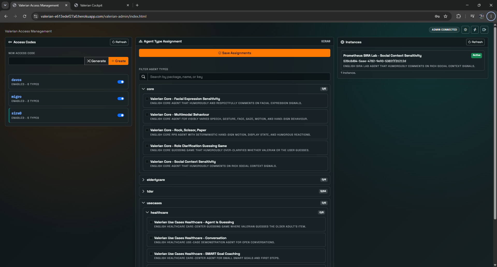
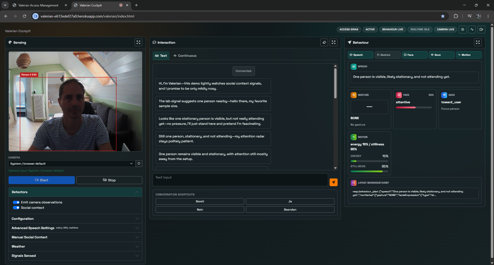
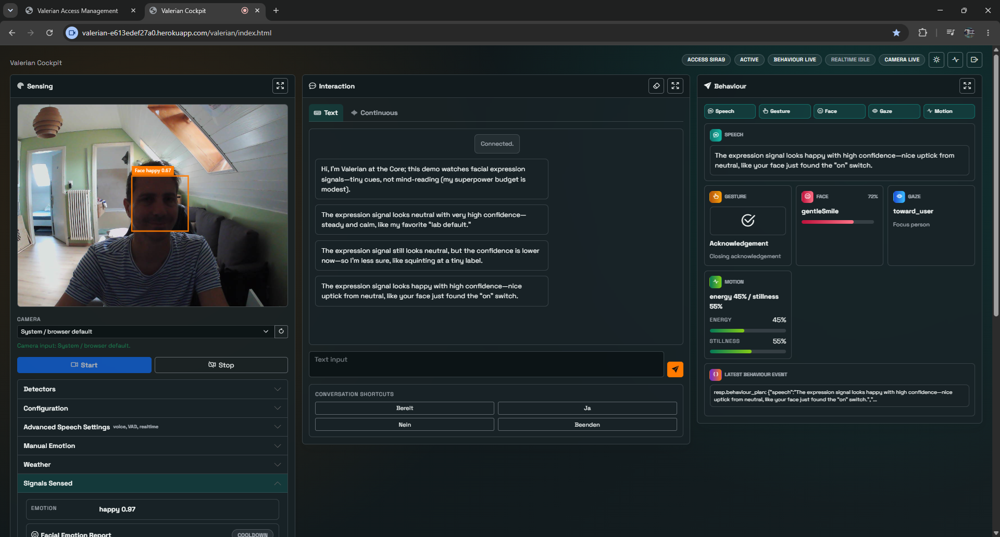
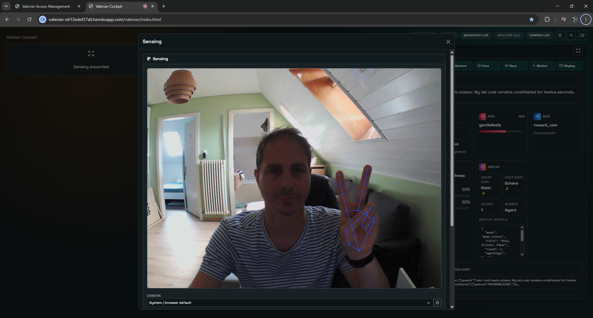
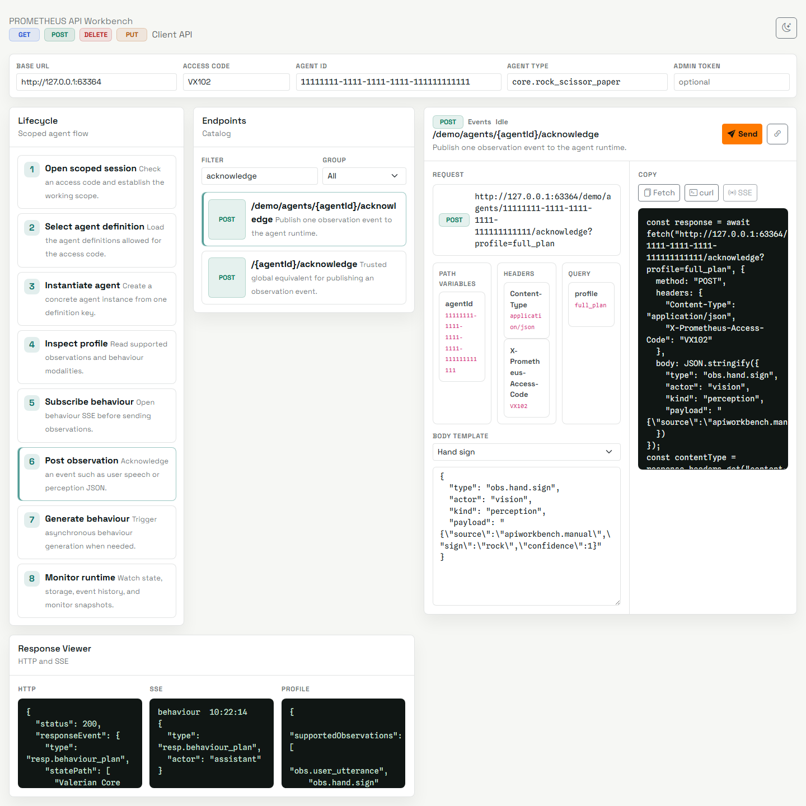

# PROMETHEUS

PROMETHEUS is an event-driven Java framework for building multimodal digital
agents with explicit state-machine control, a developing regulation layer, and
structured behaviour output.

## Why

Many agent systems still treat interaction as turn-based chat: a user says
something and the agent replies. That is too narrow for digital agents that must
work with voice, facial expression, hand signs, group context, weather, and
other signals while deciding when to speak, gesture, stay silent, or yield.

PROMETHEUS focuses on the mapping problem behind multimodal agents: how sensed
events from humans and environments become inspectable agent state, and how that
state becomes coordinated speech, nonverbal behaviour, motion intent, or display
output.

## What

PROMETHEUS provides an engineering framework for digital agents that may remain
screen-based, be embodied as VR avatars, or be connected to physical robots.
Agents are explicit state machines, not opaque chat loops. Their task logic is
implemented with states, transitions, guards, actions, prompts, and storage.

The framework treats multimodality as a first-class contract:

- Perception clients publish observations as `Event` objects.
- Agents declare accepted observations and emitted behaviour modalities through
  an `AgentInteractionProfile`.
- Agent responses are persisted as `BehaviourPlan` events with `speech`,
  `nonVerbal`, `motion`, and `display` channels.
- Streaming clients subscribe to behaviour events and render the channels that
  their target avatar, robot, or UI can support.

## How

Every runtime input is normalized as an event. A user utterance, facial emotion
sample, social grouping report, hand sign, weather context, system tick, and
internal regulation signal use the same event pipeline. The current state
decides whether the event changes control flow, updates storage, or triggers a
new behaviour plan.

The regulation foundation runs alongside task control, can maintain persisted
variables, and can emit internal opportunities back through the state machine.
Direct multimodal motivation, arbitration, and modulation of generated
behaviour are not complete yet. The state machine therefore remains explicit
and authoritative while the regulation layer develops.

## Bundled Clients

### Valerian Access Management

URL: `http://localhost:8080/valerian-admin/`



Use this client to create new access codes and assign the agent types made
available in the scope of each access code. A valid access code must be entered
before using Valerian Cockpit.

### Valerian Cockpit

URL: `http://localhost:8080/valerian/`

Valerian Cockpit is the primary all-in-one client for trying the core agents
that ship with PROMETHEUS. After entering an access code, open the drawer on
the right with the heartbeat button, choose an agent type, create an instance,
connect to it, and reset or delete it when needed. The drawer's diagnostics tab
shows runtime events and agent state.

The cockpit is organised into three columns: sensing, verbal interaction by
text or speech, and behaviour. Each column can be maximised or opened in a
separate window when an experiment needs more screen space.

Speech interaction is transcription-first: Valerian commits explicit browser
audio turns to `gpt-live-transcribe`, sends only finalized transcripts through
the ordinary scoped acknowledgement boundary, and synthesizes speech from the
resulting persisted behaviour event. New `behaviour-live` deliveries can
produce audio; ordinary history and reconnect replay remain visual-only. When
an operator starts transcription, Valerian also requests and speaks the latest
eligible assistant utterance in the agent's current state before opening
microphone input. While speech is loading or playing, microphone input is
disabled and its pending provider state is cleared so the agent cannot
transcribe itself. **Stop Playback** cancels queued/current audio and reopens
input without changing the persisted plan. A per-agent browser lease selects
one audible Valerian window, and playback uses the speaker, voice, and speed
selected in the speech settings.

**Conversation pace** in Live Transcription Settings offers Responsive (0.8-second
silence, low provider delay) and Pause tolerant (1.5 seconds, medium delay).
Pause tolerant remains the default. Presets change only these two values; saved
language, noise and device choices remain intact. Manual turn completion and
custom silence/delay values remain available. The shared multilateral listener
offers the same choices. Settings are locked during an active session.

Responsive reduces the local silence wait by 700 ms, but the frozen synthetic
pause replay produced extra segments at that threshold. Even 1.5 seconds split
the longer hesitation. Neither setting is certified for hesitant healthcare or
far-field speech; use longer custom timing or manual turns where needed. Run
`node tests/needforspeed/replay-vad.mjs` for the offline segmentation comparison.
It does not measure ASR accuracy or provider latency.

#### Cockpit lifecycle contract

The sensing, interaction, and behaviour columns represent the currently
connected agent only. An empty column contains no agent-derived history,
starter message, sensing value, or behaviour value; operator lifecycle notices
belong in diagnostics rather than the conversation.

| Lifecycle state or action | Cockpit columns |
| --- | --- |
| Access screen, accepted access code, selected agent type, or newly created instance | Empty. Selecting or creating an instance does not imply a connection. |
| Connect to a new instance | Cleared first, then initialized from that agent's current starter behaviour and subsequent events. |
| Connect to a previously used instance | Cleared first, then hydrated in persisted order with its conversation and the latest facial, social, hand-sign, weather, and behaviour values. |
| Switch instance, failed connection, or disconnect | Empty. Disconnect retains the selected instance so it can be reconnected explicitly. |
| Reset a connected instance | Cleared first, then initialized from the reset agent's new starter behaviour. |
| Log out and access the cockpit again | Empty, with access, selection, diagnostics, and agent URL identity removed. |

An explicit `agentId`/`agent` URL is the intentional exception: it identifies a
specific agent for direct-link and detached-column use and therefore attempts
that connection on load.

#### Social Context Sensitivity



This core agent demonstrates social-context sensing.

- Sensing: visual detection of human presence, groups of humans, and whether
  people are attentive toward the agent.
- Interaction: the agent comments on the social situation; users can also enter
  utterances or use transcription-first speech interaction.
- Behaviour: the full behaviour spectrum, including speech, gesture, facial
  expression, gaze, motion, hand signs, and display output where supported.

#### Facial Expression Sensitivity



This core agent demonstrates facial-expression sensing.

- Sensing: visual detection of faces and emotion, valence, and arousal.
- Interaction: the agent comments on the social situation; users can also enter
  utterances or use transcription-first speech interaction.
- Behaviour: the full behaviour spectrum, including speech, gesture, facial
  expression, gaze, motion, hand signs, and display output where supported.

#### Rock-Scissor-Paper



This core agent demonstrates a hand-sign game loop.

- Sensing: visual detection of the user's hand sign: rock, scissor, or paper.
- Interaction: ready, draw a sign, and receive the evaluation of who won; text-
  and speech-based interaction remain available.
- Behaviour: the full behaviour spectrum, plus the additional hand sign drawn
  by the agent.

### Talk to Me

URL: `http://localhost:8080/public/talktome`

Talk to Me is a reduced, public-facing Valerian-style output-only speech client.
An administrator first assigns `core.talk_to_me` to an access code. The user
then enters that code and explicitly creates, selects, and deletes their own
scoped speech instances.

Enter up to 2,000 Unicode code points and choose **Speak** to persist and speak
that exact text without language-model rewriting. The client exposes the OpenAI
Speech voices, output speed, browser speaker selection, and speaker refresh;
`alloy` is the fresh-user voice default while an explicitly saved choice is
retained. Voice and speed are locked only while a synthesis/playback request is
active. Speaker selection remains available and applies immediately. The client
does not request microphone access.

The supplied sample is loaded into the speech field on every page load. The
icon controls above the field restore that sample or clear the field; they
become available with the textarea after selecting an instance.

The browser sends one scoped speech request. PROMETHEUS first persists the
canonical `BehaviourPlan`, then sends that plan's unchanged speech channel to
OpenAI's output-only Speech API. The browser buffers the returned MP3 before
playback and reports completion only when the audio element emits `ended`.
**Stop** aborts an in-flight request or stops current playback. The
2,000-code-point boundary remains an application policy.

### API Workbench

URL: `http://localhost:8080/apiworkbench/`



The API Workbench is a guided developer client for learning and testing the
PROMETHEUS REST and SSE API. Start with the lifecycle column: open a scoped
session, list allowed agent definitions, create or select an agent, inspect its
interaction profile, subscribe to behaviour or monitor streams, and publish
observation events. The endpoint catalog can also be used directly to inspect
resolved URLs, path variables, headers, query parameters, JSON request bodies,
copyable `fetch`, `curl`, and `EventSource` snippets, HTTP responses, SSE
events, and the active agent profile.

### Multilateral Displays

URLs:

- Listener display: `http://localhost:8080/multilateral/listen/`
- Reports display: `http://localhost:8080/multilateral/reports/`

The multilateral screens are separate meeting/group displays. They are not part
of the Valerian cockpit workflow, but remain bundled for situations where a
larger audience should see live listening state or generated meeting reports.

## Current Agent Catalog

Production agent definitions live under
`src/main/java/ch/zhaw/prometheus/agentdefs`. Definitions implement
`AgentDefinition`, expose a stable key, and are discovered as Spring beans.

The main branch ships the Valerian baseline catalog:

| Key | Purpose |
| --- | --- |
| `core.facial_expression_sensitivity` | Core demo for facial-expression observations. |
| `core.multimodal_behaviour` | Core demo for coordinated multimodal output. |
| `core.rock_scissor_paper` | Core hand-sign rock-scissor-paper demo. |
| `core.role_clarification_guessing_game` | Core guessing game focused on agent/user role clarity. |
| `core.social_context_sensitivity` | Core demo for social grouping and rich social context. |
| `core.talk_to_me` | Deterministic exact-text output-only speech utility. |
| `usecases.healthcare.guessing_game` | Healthcare guessing game where Valerian guesses. |
| `usecases.healthcare.guessing_game_user_guess` | Healthcare guessing game where the user guesses. |
| `usecases.healthcare.healthcare_conversation` | Open healthcare conversation use case. |
| `usecases.healthcare.smart_goal_coaching` | Healthcare SMART-goal coaching use case. |
| `usecases.healthcare.therapy_appointment_reminder` | Single-state therapy appointment reminder. |
| `usecases.healthcare.therapy_appointment_reminder_intro` | Two-state therapy appointment reminder with introduction. |

Event- or experiment-specific agents should live in application branches,
separate modules, or deployment-specific code rather than being added to the
main baseline catalog.

## Requirements

- Java 21 or newer.
- MySQL.
- Maven Wrapper from this repository.
- Node.js only when running the Playwright visual smoke tests.
- OpenAI or Azure OpenAI configuration for prompt generation, live
  transcription, and output-only Speech synthesis.

## Local Setup

Copy the template files and adjust them for your machine:

```powershell
Copy-Item src/main/resources/application.properties.template src/main/resources/application.properties
Copy-Item src/main/resources/openai.properties.template src/main/resources/openai.properties
```

Minimum configuration:

- `spring.datasource.url`
- `spring.datasource.username`
- `spring.datasource.password`
- `openai.openaivsazureopenai`
- `openai.url`
- `openai.key`
- `openai.liveTranscriptionClientSecretUrl` and
  `openai.liveTranscriptionWebRtcUrl` only when overriding the standard OpenAI
  live-transcription endpoints
- `openai.liveTranscriptionSafetyIdentifier` when a stable,
  privacy-preserving provider safety identifier is required
- `prometheus.speech.model` and `prometheus.speech.url` when overriding the
  shared output-only Speech synthesis defaults
- `prometheus.admin.token` for Valerian Access Management

Run the application:

```powershell
.\mvnw.cmd spring-boot:run
```

The default local URL is `http://localhost:8080`; it redirects to Valerian
Cockpit.

Open the main surfaces:

- Valerian Cockpit: `http://localhost:8080/valerian/`
- Valerian Access Management: `http://localhost:8080/valerian-admin/`
- Talk to Me: `http://localhost:8080/public/talktome`
- API Workbench: `http://localhost:8080/apiworkbench/`
- Multilateral listener: `http://localhost:8080/multilateral/listen/`
- Multilateral reports: `http://localhost:8080/multilateral/reports/`

## Testing

Run the Java regression suite:

```powershell
.\mvnw.cmd test
```

Run JavaScript syntax checks for the bundled clients:

```powershell
node --check src/main/resources/public/valerian/script.js
node --check src/main/resources/public/apiworkbench/script.js
node --check src/main/resources/public/talktome/script.js
node --check tests/playwright/valerian-column-expansion.spec.mjs
node --check tests/playwright/apiworkbench.spec.mjs
node --check tests/playwright/talktome.spec.mjs
```

Run the Playwright visual smoke tests:

```powershell
npm install
npx playwright install chromium
npm run test:valerian:visual
npm run test:apiworkbench:visual
npm run test:talktome:visual
```

The Valerian Playwright test starts or reuses `http://127.0.0.1:8080`, creates
or re-enables access code `VX102` through the admin API, and checks the facial
expression report, social context report, and behaviour board. The API
Workbench Playwright test uses deterministic mocked API responses to verify the
guided lifecycle, snippets, request execution, and SSE viewer. Set
`PROMETHEUS_ADMIN_TOKEN` when your local `prometheus.admin.token` differs from
the test default. Set `PROMETHEUS_SKIP_WEBSERVER=true` when the app is already
running.

The Talk to Me Playwright test uses the running Spring application and its
configured test database for access-code assignment, scoped agent lifecycle,
exact event/behaviour persistence, synthesis request mapping, audio completion,
Stop, and deletion. It replaces only the external OpenAI Speech and physical
speaker boundary with deterministic browser fakes, then checks the light
desktop and dark mobile layouts. It uses access code `TTM31` and the same
admin-token environment override.

### Combined behaviour generation

A `PromptPolicy` with a nonverbal plan or gesture prompt now requests one JSON
behaviour plan containing speech and nonverbal output. Java composes the existing
outer, task, starter and nonverbal instructions; custom persisted prompts remain
in place and gain this behaviour after reload. Structured nonverbal instructions
apply inside `nonVerbal`, and gesture-only instructions apply to its `gesture`
field. Optional motion/display objects retain the existing contract.

Speech-only prompt policies (including final states), deterministic RPS output
and Talk to Me keep their existing paths. Invalid combined output fails without
retrying or publishing partial speech. Unknown gesture labels become `NONE`;
unsupported nonverbal move/turn fields are removed as before. The obsolete second
nonverbal request and third gesture-repair request have been removed.

Ordinary coaching now uses three text requests: two decisions and one combined
behaviour request. Startup and direct facial/social reactions use one generation
request. These are offline call-count results; measured provider latency and
response quality are tracked separately in the results ledger.

### Task-specific text inference

The text SPI accepts typed `InferenceRequest` snapshots with purpose, messages,
output shape, optional JSON schema, request ID and correlation ID. Existing
semantic gateway methods remain available for custom/test gateways. Purposes
are `behaviour`, `nonverbal`, `decision`, `extraction`, and `summary`; they are
explicit in code rather than guessed from prompt wording.

`openai.model` remains the fallback. Configure `openai.reasoning-effort` and
`openai.routes.<purpose>.model`, `.reasoning-effort`, `.max-completion-tokens`,
`.timeout-ms` or `.url` to override a purpose. Blank effort uses the provider
default. The template contains an opt-in Sol/Luna configuration with `none`
effort; no existing installation switches models automatically. The output cap
includes reasoning tokens. Text HTTP requests have a 30-second default deadline
and a 10-second connection deadline; failures do not retry or escalate models.

For Azure, the URL identifies the deployment. A model override must include its
matching deployment URL; `model` identifies the underlying model for capability
validation and is not sent in Azure payloads. These routes have only been tested
against loopback HTTP providers, not live OpenAI or Azure accounts.

Optional sampling parameters are omitted on reasoning model families to avoid
model/effort incompatibilities. This changes the former temperature-zero decision
payload on GPT-5.2; compare decision quality before promoting candidate routes.
Non-reasoning models retain temperature 1 for behaviour and 0 for structured
work. Invalid booleans/JSON, missing content, refusal, filtering and truncated
completions fail explicitly. Provider error bodies are not included in errors.

Provider references: [GPT-5.6 Sol](https://developers.openai.com/api/docs/models/gpt-5.6-sol),
[GPT-5.6 Luna](https://developers.openai.com/api/docs/models/gpt-5.6-luna) and
[GPT-5.2](https://developers.openai.com/api/docs/models/gpt-5.2). Sol/Luna support
Chat Completions and `none` effort; account access and task quality remain to be
established for each deployment.

### Response latency diagnostics

POST requests accept an optional UUID `X-Prometheus-Trace-Id` and return a validated
trace ID. A request that publishes behaviour also returns
`X-Prometheus-Behaviour-Id`, identifying the persisted event delivered on SSE.
These headers do not grant access or change event payloads. Configured CORS
origins can send/read them.

Server `latency` log entries record inference purpose, model, effective configured effort (or provider default),
token counts when supplied, application/persistence/publication durations and
Speech response-header time. Durations are monotonic. Successful provider prompt
and response bodies are no longer logged by the text gateway.
Valerian retains at most 128 content-free turn and event timing records in memory:
`PrometheusTimings.snapshot(agentId)`. Transcript ingress, canonical SSE receipt,
rendering, first audio byte and media `playing` are joined even when SSE beats
the HTTP response. Shared transcription records local last-voice/commit and final
transcript times; manual or unmatched commits have no invented voice timestamp.
No timing telemetry is uploaded or persisted. Server and browser clocks are
separate; correlate IDs, then compare local durations.

Run `node --test tests/js/performance/*.test.mjs` and
`CatalogInferenceCountUnitTest` for offline diagnostics checks. The roadmap and
measured/unverified results are maintained in `.agents/PLAN_NEEDFORSPEED.md` and
`.agents/NEEDFORSPEED_RESULTS.md`.

## Connecting External Clients

External clients usually use the scoped demo API. It keeps agent instances
behind an access code and mirrors what the Valerian cockpit does. Trusted
backend tools can use the global agent endpoints shown later.

### 1. Open a scoped session

Create an access code and assign agent types in Valerian Access Management, or
use the admin API. Then validate the code:

```http
POST /demo/session
Content-Type: application/json

{
  "accessCode": "VX102"
}
```

The response contains the enabled agent types and existing scoped agents.

### 2. Create or select an agent

List agent types available to the code:

```http
GET /demo/agent-types
X-Prometheus-Access-Code: VX102
```

Create an assigned agent type:

```http
POST /demo/agents
X-Prometheus-Access-Code: VX102
Content-Type: application/json

{
  "agentDefinitionKey": "core.social_context_sensitivity"
}
```

Read the agent metadata before enabling perception or rendering controls:

```http
GET /demo/agents/{agentId}/info
X-Prometheus-Access-Code: VX102
```

Relevant response fields:

```json
{
  "id": "11111111-1111-1111-1111-111111111111",
  "name": "Valerian Core social context sensitivity",
  "description": "English Valerian Core agent for social-context sensing.",
  "active": true,
  "languageCode": "en",
  "interactionProfile": {
    "supportedObservations": [
      "obs.user_utterance",
      "obs.human.presence",
      "obs.social.grouping",
      "obs.social.context"
    ],
    "supportedBehaviourModalities": [
      "speech",
      "nonVerbal.gesture",
      "nonVerbal.facialExpression",
      "nonVerbal.gaze",
      "nonVerbal.motion"
    ],
    "profileTags": []
  }
}
```

Clients should use `supportedObservations` to decide which sensing UI or sensors
to enable, and `supportedBehaviourModalities` to decide which behaviour channels
to render. An empty profile means "unknown"; fall back conservatively.

### 3. Publish perception events

Send observations to the agent with `acknowledge`:

```http
POST /demo/agents/{agentId}/acknowledge
X-Prometheus-Access-Code: VX102
Content-Type: application/json

{
  "type": "obs.user_utterance",
  "actor": "user",
  "kind": "observation",
  "payload": "What do you notice about this group?"
}
```

`payload` is always a string. For structured observations, encode the structured
payload as JSON inside the string:

```json
{
  "type": "obs.hand.sign",
  "actor": "user",
  "kind": "observation",
  "payload": "{\"source\":\"external.camera\",\"hand\":\"right\",\"sign\":\"rock\",\"confidence\":0.93,\"detectionMode\":\"client_camera\",\"ts\":\"2026-07-08T09:00:00Z\"}"
}
```

The response is:

```json
{
  "responseEvent": {
    "type": "resp.behaviour_plan",
    "actor": "assistant",
    "kind": "response",
    "payload": "{\"speech\":\"I saw rock. I will reveal mine now.\",\"motion\":{\"handSign\":\"paper\"}}",
    "createdDate": "2026-07-08T09:00:01Z",
    "statePath": ["Valerian Core RPS Reveal Sign"]
  },
  "active": true
}
```

`responseEvent` may be `null` when the event updates context but does not trigger
new behaviour.

Supported observation event types in the current public contract:

| Event type | Actor | Payload |
| --- | --- | --- |
| `obs.user_utterance` | `user` | Plain utterance text. |
| `obs.emotion.face` | `user` | JSON string with `emotion`, `confidence`, `valence`, `arousal`, optional `expressions`, source, and timestamp. |
| `obs.human.presence` | `user` | JSON string with aggregate human/tracked counts and source. |
| `obs.social.grouping` | `user` | JSON string with group count, singleton count, largest group size, groups, and source. |
| `obs.social.context` | `user` | JSON string with `schemaVersion: 1`, aggregate group fields, and per-person movement/attention fields. |
| `obs.hand.sign` | `user` | JSON string with `sign` as `rock`, `scissor`, or `paper`, plus confidence/source fields. |
| `obs.weather.current` | `system` | JSON string with location, condition, intensity, wind, temperature, precipitation, and timestamp. |
| `obs.weather.forecast` | `system` | JSON string with location and `days[]` forecast entries. |

Use only observations declared by the agent profile unless you are deliberately
testing fallback behaviour.

### 4. Subscribe to behaviour

Behaviour clients subscribe with Server-Sent Events:

```http
GET /demo/agents/{agentId}/behaviour/stream?accessCode=VX102
Accept: text/event-stream
```

Browser `EventSource` cannot set custom headers, so scoped browser clients pass
`accessCode` as a query parameter. Non-browser clients may use the
`X-Prometheus-Access-Code` header instead.

Each behaviour event has:

- SSE event name: `behaviour-live` for a new publication or
  `behaviour-replay` for initial/history/reconnect recovery
- SSE id: persisted event id when available
- SSE data: an `Event` object with type `resp.behaviour_plan`

The event `payload` is a JSON string containing a `BehaviourPlan`:

```json
{
  "speech": "That looks like a small group.",
  "nonVerbal": {
    "gesture": "ACKNOWLEDGE",
    "facialExpression": { "type": "attentive", "intensity": 0.55 },
    "gaze": { "direction": "toward_group", "focus": "group" },
    "motion": { "stillness": 0.75, "energy": 0.35 }
  },
  "motion": {
    "handSign": "paper"
  },
  "display": {
    "title": "Social context",
    "summary": "Two people nearby"
  }
}
```

Clients should ignore channels they cannot render. Reconnect with either the
standard `Last-Event-ID` header or `?lastEventId=<id>` to replay missed
behaviour events. Replayed events retain their original persisted IDs, data,
and order, but are labeled `behaviour-replay`; clients must not repeat live-only
effects such as speech playback for them. Heartbeats remain SSE comments.
Valerian correlates both persisted event IDs and stable event-envelope
fingerprints so an initial-history response followed by an SSE replay renders
the same behaviour only once.

### 5. Request generated behaviour without a new perception event

Clients can ask the current state to generate another complete behaviour plan:

```http
POST /demo/agents/{agentId}/behaviour/generate
X-Prometheus-Access-Code: VX102
Content-Type: application/json

{
  "outputProfile": "FULL_PLAN",
  "omitModalities": ["display"]
}
```

`FULL_PLAN` is the only output profile. The profile can be omitted because it is
also the default. `omitModalities` remains available when a renderer explicitly
cannot consume one of the otherwise supported behaviour channels.

The endpoint returns `200` when behaviour was generated, `409` when no behaviour
was produced, `404` when the agent is missing, and `400` for an unknown profile.

### 6. Monitor state and storage

Use these endpoints for diagnostics and operator UI:

```http
GET /demo/agents/{agentId}/state
GET /demo/agents/{agentId}/states
GET /demo/agents/{agentId}/storage
GET /demo/agents/{agentId}/eventhistory
GET /demo/agents/{agentId}/monitor/stream?accessCode=VX102
```

The monitor SSE stream emits `snapshot` events with current state, inner state
chain, active flag, known states, and storage entries.

## Global Agent API

The global API is useful for trusted tools, tests, or internal services. It is
not access-code scoped.

| Method | Path | Purpose |
| --- | --- | --- |
| `GET` | `/agent` | List persisted agents. |
| `POST` | `/agent/singlestate` | Create an ad-hoc single-state agent. |
| `GET` | `/{agentId}/info` | Agent metadata and interaction profile. |
| `POST` | `/{agentId}/start` | Start the current state. |
| `DELETE` | `/{agentId}/reset` | Reset the agent. |
| `POST` | `/{agentId}/acknowledge` | Publish an event. |
| `GET` | `/{agentId}/prompt?profile=...` | Inspect the prompt contract. |
| `POST` | `/{agentId}/behaviour/generate` | Generate behaviour from current state. |
| `GET` | `/{agentId}/behaviour/stream` | Subscribe to behaviour SSE. |
| `GET` | `/{agentId}/monitor/stream` | Subscribe to monitor SSE. |

The request and response shapes are the same as the scoped demo API, without the
access-code header. Where a `profile` or `outputProfile` is accepted, omit it or
use `full_plan`; former speech/complement profiles are not supported.

## Transcription-First Speech

### Scoped live transcription

The transcription-first speech architecture uses an access-code-scoped,
transcription-only session contract. Read its agent-language-aware settings
descriptor first:

```http
GET /demo/agents/{agentId}/transcription/capabilities
X-Prometheus-Access-Code: VX102
```

Then issue an ephemeral `gpt-live-transcribe` WebRTC session:

```http
POST /demo/agents/{agentId}/transcription/session
X-Prometheus-Access-Code: VX102
Content-Type: application/json

{
  "turnDetection": {
    "type": "local_vad",
    "silenceDurationSeconds": 1.5
  },
  "noiseReduction": "far_field",
  "transcriptionPrompt": "محادثة مع وكيل بروميثيوس.",
  "transcriptionKeywords": ["بروميثيوس", "عائشة"],
  "languages": ["ar"],
  "transcriptionDelay": "medium"
}
```

Supported noise-reduction values are `near_field`, `far_field`, and `off`.
Supported turn modes are `local_vad` and `manual`; both keep provider turn
detection disabled so the browser commits explicit audio turns. Supported
languages are currently `ar`, `de`, and `en`, and delay accepts `minimal`, `low`,
`medium`, `high`, or `xhigh`. Omitted settings use far-field capture, local VAD
with 1.5 seconds of silence, the selected agent's language, and medium delay.

The response contains the ephemeral client secret, fixed model and session
type, settings schema version, OpenAI WebRTC URL, and a non-sensitive effective
settings summary. The prompt text and keywords are never echoed in that
summary. There is no combined speech-to-speech session or unscoped
transcription-session endpoint.

### Shared browser transcription engine

Valerian and `/multilateral/listen` use the same ES-module engine under
`public/transcription`. It acquires a cross-tab microphone lease, applies the
requested browser capture constraints, creates only a transcription WebRTC
data channel, commits local-VAD or manual turns, orders terminal transcripts by
provider item ID, and reconnects with a fresh scoped ephemeral secret. Partial
transcripts are display-only; a provider assistant response or remote media
track is reported as an unexpected diagnostic and is never rendered.

The operator panel exposes provider noise reduction, local/manual turn mode,
silence duration, context, keywords, expected languages, transcription delay,
input device, echo cancellation, noise suppression, automatic gain control,
and voice isolation when supported. The default group profile is far-field,
local VAD with 1.5 seconds silence, the agent language, medium delay, browser
echo/noise/gain processing enabled, and voice isolation disabled. Requested and
browser-applied capture values are displayed separately. Context and keywords
are intentionally not stored in local storage.

### Operational resilience and acoustic limits

The shared transport reacquires the selected microphone and requests a fresh
scoped ephemeral session after connection/data-channel failure or when the
active microphone track ends. It makes at most two automatic reconnect
attempts with exponential backoff; if they are exhausted, the operator sees
the last actionable failure instead of an indefinite reconnect state. Browser
`devicechange` events refresh the microphone and speaker choices.

Explicit Stop, page navigation, agent switch/delete, reset, and failed startup
release microphone tracks and the cross-tab lease. Reset follows the cockpit
lifecycle by stopping transcription and leaving it idle; the operator starts a
new session when ready. One browser tab owns microphone capture at a time, and
one Valerian tab owns audible output for each agent. A tab that retains the
microphone lease may keep accepting finalized provider events while hidden,
but browser background throttling, wireless-device behavior, network recovery,
and acoustic quality must still be checked on the target deployment hardware.

`gpt-live-transcribe` supplies transcript text, not speaker identity, in this
contract. PROMETHEUS can accept sequential turns from several people, but it
does not diarize them. Simultaneous or overlapping speech may be merged, split,
or partly missed and must not be treated as reliably attributed input. Manual
turn commit remains available when an operator needs an explicit boundary in a
difficult room.

Run its deterministic browser gates with:

```powershell
npm.cmd run test:transcription:unit
npm.cmd run test:speech:unit
npm.cmd run test:valerian:lifecycle
npm.cmd run test:valerian:transcription
npm.cmd run test:valerian:visual
```

These suites mock microphone, WebRTC, SDP exchange, and provider events. They
do not replace the real acoustic matrix in
`.agents/TRANSCRIBE_SMOKE_RESULTS.md`. Before release on a target installation,
record its actual microphone and speaker models and execute that matrix in
near-field, far-field, noisy/outdoor, wireless/Bluetooth, and multiple-speaker
conditions. Keep every unperformed row marked `NOT RUN`.

Final provider transcripts enter PROMETHEUS through the same scoped event
boundary as typed input:

```http
POST /demo/agents/{agentId}/acknowledge?profile=full_plan
X-Prometheus-Access-Code: VX102
Content-Type: application/json

{"type":"obs.user_utterance","actor":"user","kind":"observation","payload":"Hello Valerian"}
```

The shared browser ingress serializes final turns, suppresses duplicate/stale
provider terminals, and exposes queued, sending, accepted, rejected, and
provider-error diagnostics. Partial or failed provider input is never sent.
The acknowledgement response is used only for lifecycle/fallback decisions;
canonical `resp.behaviour_plan` rendering remains driven by the behaviour SSE
stream so the same plan cannot appear twice. If acknowledgement legitimately
returns no response event, the client preserves typed-input semantics by
requesting one normal `full_plan` generation.

Valerian's output queue accepts `behaviour-live` events with non-empty speech
and a persisted SSE event ID. It processes those IDs in order and keeps
completed, failed, and deliberately skipped IDs distinct, so duplicate live
delivery and ordinary history/reconnect replay cannot speak twice. An explicit
transcription start may enqueue the current state's latest eligible assistant
event again; this intentional resume delivery is repeatable on later starts and
still synthesizes only the persisted plan. Synthesis begins through the
canonical event-scoped endpoint below, and playback is routed to the selected
output device. The microphone remains gated across a queued burst and opens
only after resume playback has been attempted; it reopens after completion,
Stop, synthesis/playback error, disconnect, or agent change. An expiring
cross-tab output lease ensures that only one Valerian page speaks a particular
agent's event.

### Output-only Speech

Any scoped client can request audio for the canonical speech in an already
persisted behaviour-plan event:

```http
GET /demo/agents/{agentId}/behaviours/latest/speech
X-Prometheus-Access-Code: VX102
```

This discovery endpoint returns `{ "eventId": "..." }` only when the latest
utterance in the agent's current-state history is an assistant behaviour plan
with speech. A later user utterance makes it return `204`, preventing stale
assistant speech from being replayed while a response is still pending. It
does not synthesize audio or mutate the agent.

Use the returned persisted identity with the canonical synthesis endpoint:

```http
POST /demo/agents/{agentId}/behaviours/{eventId}/speech?voice=cedar&speed=1.25
X-Prometheus-Access-Code: VX102
```

`eventId` is the UUID delivered as the behaviour SSE event ID. PROMETHEUS looks
up that event only in the scoped agent's history, requires a
`resp.behaviour_plan` with non-empty speech, and sends its exact persisted
speech to the provider. This endpoint has no request body and therefore cannot
synthesize browser-authored or foreign-agent text. It returns uncached,
streamed provider audio with an explicit `audio/*` content type. Unknown agents
or events return `404`; events that are not usable speech behaviours return
`409`; unsupported voices or speeds outside `0.25` through `4.0` return `400`.
The defaults are `alloy` and `1.0`.

Talk to Me sends the observation and speech options to a scoped backend
endpoint:

```http
POST /demo/talktome/agents/{agentId}/speech?voice=cedar&speed=1.25
X-Prometheus-Access-Code: TTM31
Content-Type: application/json

{"type":"obs.user_utterance","actor":"user","kind":"observation","payload":"Exact text"}
```

The dedicated endpoint first verifies that the scoped agent carries the
`utility.talk_to_me` profile tag. PROMETHEUS then acknowledges the observation
with the ordinary `FULL_PLAN` output profile, persists the deterministic
`core.talk_to_me` speech plan, and passes that canonical speech string to
`prometheus.speech.url` using `prometheus.speech.model` (default:
`gpt-4o-mini-tts`). The Talk to Me endpoint retains its exact-text behavior and
`utility.talk_to_me` agent-tag restriction while sharing provider configuration,
voice/speed validation, and streamed HTTP audio mechanics with canonical
behaviour speech.

## Admin API

Admin endpoints require:

```http
X-Prometheus-Admin-Token: <prometheus.admin.token>
```

| Method | Path | Purpose |
| --- | --- | --- |
| `GET` | `/admin/agent-types` | List registered `AgentDefinition` types with package metadata. |
| `GET` | `/admin/access-code-presets` | List backend-defined access-code presets. |
| `POST` | `/admin/access-code-presets/{presetKey}/apply` | Create a preset bundle transactionally. |
| `POST` | `/admin/access-codes` | Create an access code. |
| `GET` | `/admin/access-codes` | List access codes. |
| `PATCH` | `/admin/access-codes/{id}` | Enable or disable a code. |
| `PUT` | `/admin/access-codes/{id}/agent-types` | Replace assigned agent type keys. |
| `GET` | `/admin/access-codes/{id}/agents` | List agents linked to a code. |

Access codes must be exactly five ASCII letters or digits. The backend treats
them as case-sensitive.

## CORS

Bundled clients are same-origin. External browser clients need an explicit
allowlist:

```properties
prometheus.cors.allowed-origins=http://127.0.0.1:5010,http://localhost:5010
prometheus.cors.allowed-origin-patterns=http://127.0.0.1:*,http://localhost:*
```

Keep this narrow because the scoped access code acts as a bearer-style client
credential.

## Repository Structure

```text
src/main/java/ch/zhaw/prometheus
  agentdefs/        Registered Valerian agent definitions.
  application/      Application services for agents, access codes, transcription, Speech, and scoped demos.
  controllers/      HTTP, SSE, admin, scoped demo, and static-client endpoints.
  logging/          SSE broadcasters.
  model/            Agent, state machine, event, behaviour, policy, regulation, and RPS domain model.
  spi/              Language-model, live-transcription, and Speech integration boundaries.

src/main/resources/public
  apiworkbench/     Guided REST/SSE API workbench for client developers.
  multilateral/     Meeting/group listener and report displays.
  talktome/         Public exact-text output-only Speech client.
  valerian/         Valerian cockpit.
  valerian-admin/   Valerian access management.

tests/playwright    Browser-level Valerian, Talk to Me, and API Workbench smoke tests.
```

## Developing New Agents

1. Start from an existing definition in `agentdefs/core` or
   `agentdefs/usecases/healthcare`.
2. Define prompts for state entry, response generation, transitions, actions,
   and outcome extraction.
3. Declare an `AgentInteractionProfile` that lists required observations and
   emitted behaviour modalities.
4. Implement `AgentDefinition` with a stable key and expose it as a Spring bean.
5. Use `createInstance(...)` for startup behaviour that should run immediately
   after scoped creation.
6. Add prompt/profile contract tests and update README/API examples if the
   public contract changes.

Prefer clear replacement over compatibility shims while the framework remains
prototype-oriented.

## Deployment Notes

The repository contains Heroku/container-oriented resources:

- `Dockerfile`
- `src/main/resources/application-prod.properties`
- `src/main/resources/openai-prod.properties`
- `.github/workflows/deployment.yml`

Production deployments must provide database credentials and OpenAI credentials
through environment variables or platform config vars.

## Project Notes

- `.agents/messageinabottle.txt` is the compact session bootstrap prompt for a
  new coding agent.
- `.agents/CODEX.md` contains reusable, project-neutral engineering and
  milestone practices.
- `.agents/CONTEXT.MD` describes PROMETHEUS's purpose, current capabilities,
  regulation gaps, architecture, and repository boundaries.
- The top of `PROJECT.md` is the current engineering snapshot. The remaining
  milestone records are a historical audit to search selectively, not required
  startup reading.

### Compatible transition checks

`openai.guard-strategy=combined` groups known pure `StaticDecision`/`PromptPolicy`
checks from the active state path into one structured boolean request. Each check
retains its own selected history and resolved prompt. Java still applies outer,
transition-list and decision-list priority and executes selected actions once.
Local event-type filters can reject pure conjunctions before model inference.
Unknown state/decision subclasses, unconditional transitions and actions are
barriers; action execution invalidates all unused results. No cross-turn cache.

Groups require the same effective provider route and are bounded by
`openai.guard-batch-size` (16) and `openai.guard-max-characters` (65536 serialized
prompt characters); oversized/single checks use ordinary ordered calls. Provider
output-token limits still apply. Missing/extra IDs or non-boolean values fail the
whole group before actions. This is synchronous request composition, not the
OpenAI Batch API. Custom gateways remain ordered unless they opt in through
`guardInferenceOptions()`. Use `openai.guard-strategy=ordered` for comparison or a
deployment without strict structured outputs. Combining prompts can change model
judgments; live corpus quality remains a separate release check.

For explicit experiments, `openai.guard-strategy=parallel` evaluates separate
pure checks concurrently, and `combined_parallel` evaluates separate compatible
groups concurrently. Neither speculates on behaviour generation or actions.
Default limits are 4 global requests, 3 per turn, 16 waiting tasks, 5000 ms for
admission/queue waiting and 30000 ms per guard-evaluation session. Configure these
with `openai.guard-parallelism`, `guard-per-turn-parallelism`,
`guard-queue-capacity`, `guard-queue-wait-ms`, and `guard-turn-timeout-ms`.
All names use the `openai.` prefix. At most 64 candidates are prepared; subsequent
checks stay ordered. Admission reserves the entire group set within bounded
capacity; overload fails explicitly without redispatching the same work.

Results are consumed in logical priority order. A required failure/deadline
aborts evaluation; unneeded requests are cancelled on transition or turn end.
Already dispatched work may still be billed after cancellation. Provider timing
logs include request IDs and queue waits, but absent usage on cancellation is
unknown usage, not zero cost. Custom gateways need an explicitly supplied guard
executor and must be thread-safe to opt into parallel modes.

The application serializes each agent's start/acknowledge/generate/reset/tick
and scoped deletion operations, loading its aggregate after acquiring the lock.
Workers receive only immutable inference requests. Enclosing local transactions
retain the lock until commit/rollback. This is in-process serialization, not a
distributed lock across application instances. Scheduled ticks use the same
application boundary. Independent agents can proceed concurrently.

### Progressive canonical Speech playback

Valerian streams the existing scoped event-ID Speech POST into an MP3
`MediaSource` when supported. Playback can start before download completion;
voice/speed, selected output device, queue ordering, cross-tab output ownership,
replay suppression and half-duplex input gating retain their existing owners.
Unsupported browsers and failures during media-source setup use the same fetched
body as a buffered Blob. Decoding failures after setup fail the item; they never
request synthesis again or replay a spoken prefix. Stop aborts the reader and
cleans up media resources. Both paths cap compressed audio at 16 MiB and stream
reads/media preparation have a 30-second inactivity limit. The backend flushes
each provider chunk and closes its upstream stream on downstream write failure.

Local Chromium playback and the provider-to-Tomcat path are tested with withheld
response tails. A deployed reverse proxy can still buffer responses; verify it
and real output devices separately. See the [MSE specification](https://www.w3.org/TR/media-source-2/)
for the browser mechanism. The latency endpoint remains meaningful audio playback,
not arrival of the first HTTP byte.
