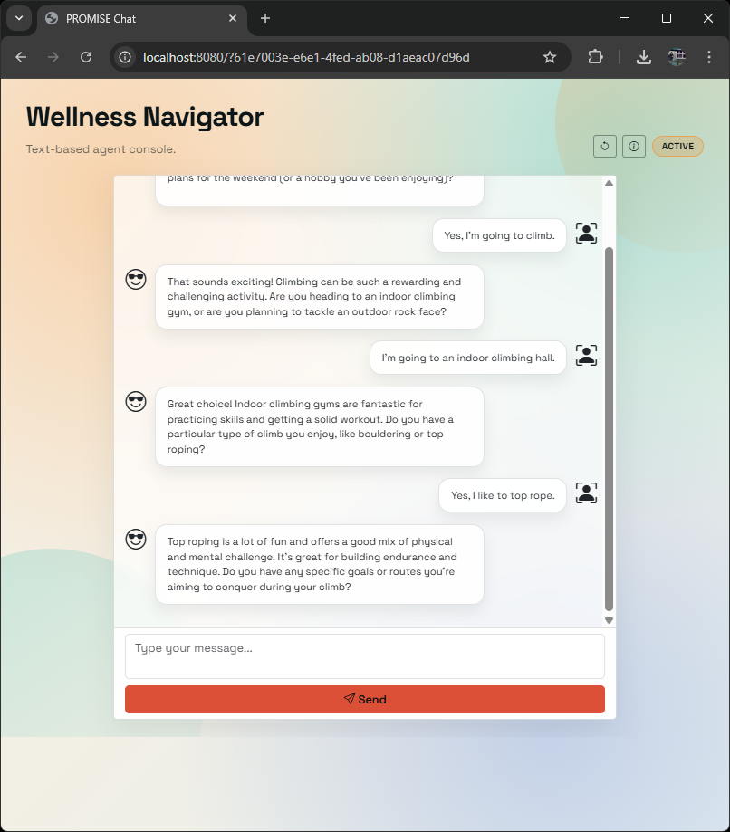
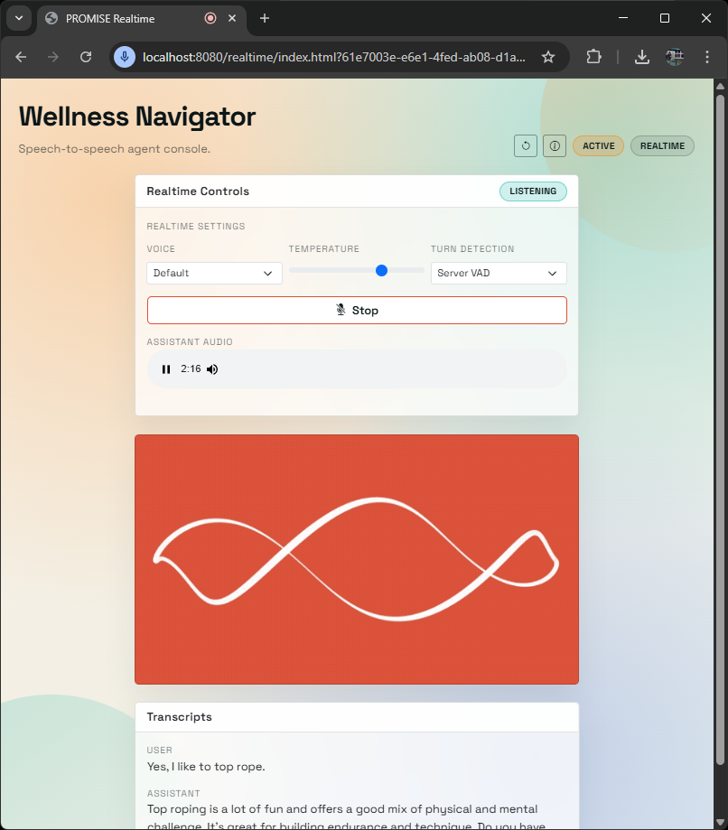
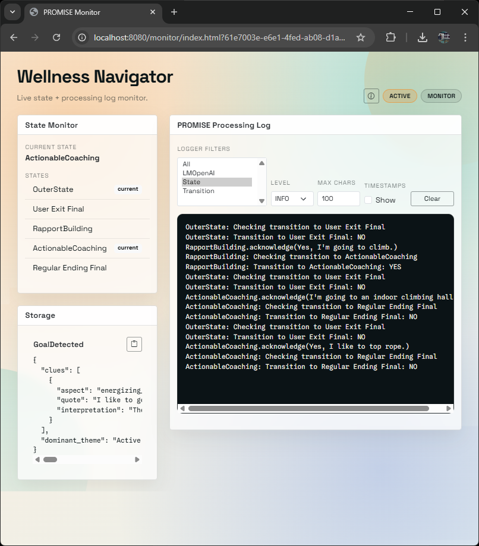
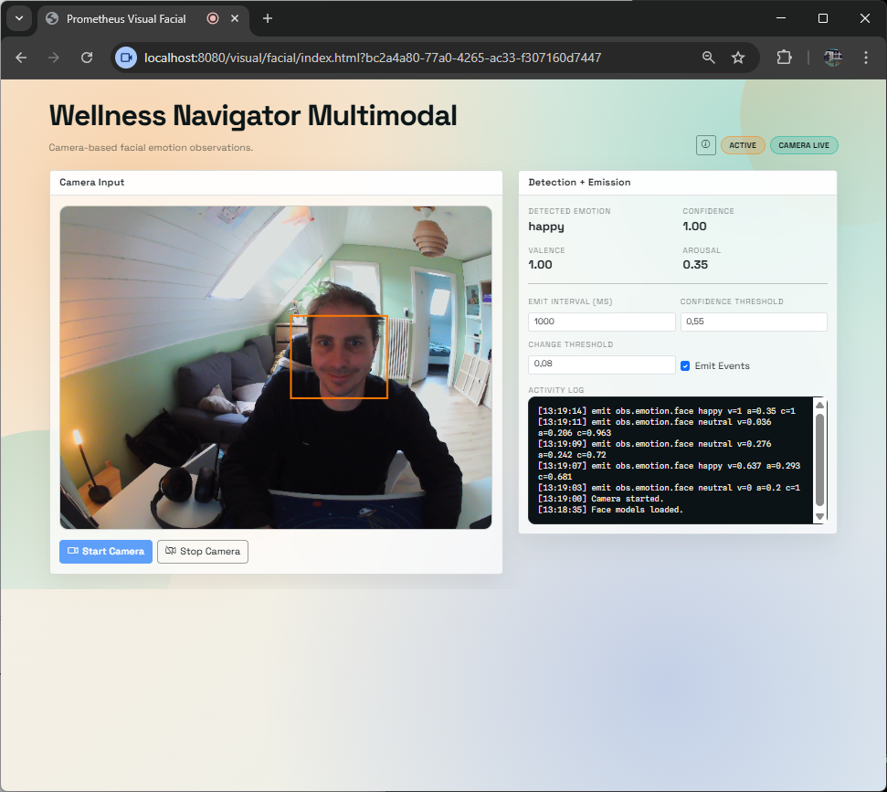
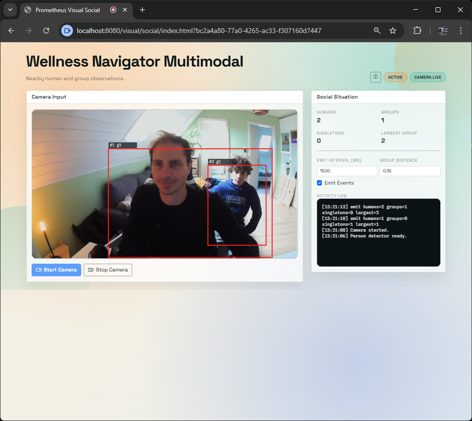
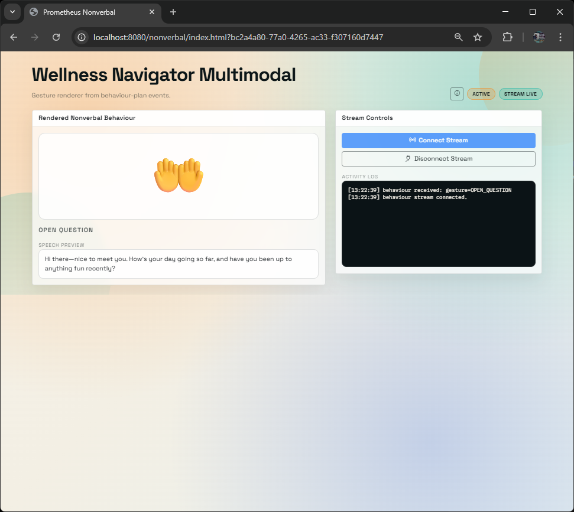

# PROMETHEUS

PROMETHEUS is an event-driven Java framework for building digital agents with explicit state-machine control and a first-class regulation layer.

It evolves the PROMISE approach from turn-based text interaction into multimodal sensing and multimodal behaviour while keeping transitions, guards, and actions explicit and testable.

### Why

Many agent systems still assume turn-based chat: user says something, agent replies. That model breaks in real environments where agents must interpret voice, visual, social, and system signals continuously, decide when to act proactively, and sometimes stay silent, yield, or disengage safely.

### What

PROMETHEUS is an event-driven, regulation-aware framework for engineering multimodal agents with explicit control. It combines inspectable state-machine task logic with first-class regulation, so behaviour can adapt to context without becoming opaque or unpredictable.

### How

PROMETHEUS models all inputs as `Event` objects and all outputs as structured `BehaviourPlan` objects (`speech`, `nonVerbal`, `motion`, `display`). State transitions, guards, and actions remain explicit and testable, while regulation modules modulate expression and emit bounded control signals (for example opportunities and interrupts). This unified model supports use cases from conversational check-ins to embodied assistance and ambient monitoring.

## What You Can Build

- Digital agents with two-layer behaviour control: state-machine interaction flow plus regulation inspired by motivational models for adaptive behavior.
- Multimodal agents that combine user utterances with multimodal sensing (e.g., facial expressions, heart rate variability, gaze, social context).
- Multimodal behaviour generation across channels (e.g., gestures, facial expressions, gaze, proxemics, prosody).
- Embodied AI scenarios such as virtual avatars and robotic systems.

## Clients (Quick Tour)

All clients take `?agentId=<uuid>`.
For the complete list including multilateral endpoints, see `All Client Endpoints` below.

### GIGI Demo Cockpit

- URL: `http://localhost:8080/gigi-demo/?agentId=<uuid>`
- Aliases: `http://localhost:8080/gigi/?agentId=<uuid>`, `http://localhost:8080/tdsr/?agentId=<uuid>`
- Purpose: single-page TDSR demo surface with agent selection, text input, realtime speech-to-speech, camera sensing controls, manual event shortcuts, behaviour visualization, and diagnostics drawer.
- Agent selection/start controls live in the drawer. Dropdown selection or manual typing only selects an Agent ID; `Connect` validates it and opens live streams. Once connected, the same button becomes `Disconnect`. `Start Agent` calls the agent runtime start endpoint.
- Without an explicit `?agentId=` URL or drawer selection, the cockpit leaves the Agent ID empty and does not auto-connect to a stored or guessed agent.
- The center column has separate Text and Realtime Speech tabs. Sensing and sensed input signals are on the left; rendered `BehaviourPlan` output is on the right.
- Camera sensing modes are independently toggleable while the camera is running. Face emotion, social grouping, and hand-sign detection can run in any combination; event emission uses per-mode throttles.
- The sensing card groups detectors, configuration, manual emotion/social/hand inputs, and sensed signal readouts in one accordion. Behaviour modalities render as full-width rows.
- After `Connect`, the cockpit reads `interactionProfile` from agent info and hides irrelevant sensing controls and behaviour rows. Agents without a declared profile keep the full cockpit visible as a fallback.

### Text Client

- URL: `http://localhost:8080/?agentId=<uuid>`
- Purpose: text-first conversational interaction with the agent.



### Realtime Client

- URL: `http://localhost:8080/realtime/?agentId=<uuid>`
- Purpose: low-latency voice interaction via OpenAI Realtime.



### Monitor Client

- URL: `http://localhost:8080/monitor/?agentId=<uuid>`
- Purpose: live runtime visibility (state snapshots, behaviour events, logs).



### Visual Facial Client

- URL: `http://localhost:8080/visual/facial/?agentId=<uuid>`
- Purpose: visual/facial rendering channel for multimodal output.



### Visual Multifacial Client

- URL: `http://localhost:8080/visual/multifacial/?agentId=<uuid>`
- Purpose: facial-emotion capture with per-user naming for multi-user interactions.

### Visual Social Client

- URL: `http://localhost:8080/visual/social/?agentId=<uuid>`
- Purpose: social visual presentation channel for multimodal output.



### Nonverbal Behaviour Renderer

- URL: `http://localhost:8080/nonverbal/?agentId=<uuid>`
- Purpose: dedicated nonverbal behaviour stream rendering.



### RPS Manual Client

- URL: `http://localhost:8080/rps/?agentId=<uuid>`
- Purpose: Schere-Stein-Papier demo surface that renders GIGI's `motion.handSign` and emits manual or camera-detected `obs.hand.sign` events.

## Core Concepts

- `Event`: unified input and internal signal model (observations, responses, control events).
- `State` and `Transition`: explicit control with prompt-based decisions and actions.
- `BehaviourPlan`: structured output across behaviour modalities (`speech`, `nonVerbal`, `motion`, `display`).
- `Storage`: per-agent key-value memory shared across states.
- `OuterState`: hierarchical control across nested state machines.
- Regulation and policy runtime: modulation is explicit and bounded by control semantics.

## Tech Stack

- Java 21
- Spring Boot 3.4.x
- Maven Wrapper (`mvnw`, `mvnw.cmd`)
- MySQL (JPA/Hibernate)

## Local Setup

### 1. Prerequisites

- JDK (`java -version`)
- MySQL running locally

### 2. Configure properties

Create or update:

- `src/main/resources/application.properties`
- `src/main/resources/openai.properties`

You can copy from:

- `src/main/resources/application.properties.template`
- `src/main/resources/openai.properties.template`

Minimum local fields:

- DB: `spring.datasource.url`, `spring.datasource.username`, `spring.datasource.password`
- OpenAI or Azure: `openai.openaivsazureopenai`, `openai.url`, `openai.key`
- Optional realtime: `openai.realtimeModel`, `openai.realtimeTranscriptionModel`,
  `openai.realtimeTranscriptionLanguage`, `openai.realtimeTranscriptionDelay`,
  `openai.realtimeSafetyIdentifier`, `openai.realtimeClientSecretUrl`, `openai.realtimeCallsUrl`

### 3. Run

```bash
./mvnw spring-boot:run
```

PowerShell:

```powershell
.\mvnw.cmd spring-boot:run
```

App default URL: `http://localhost:8080`

## Seed or Create Agents

### Option A: Seed example agents from tests

Templates:

- `src/test/java/ch/zhaw/prometheus/agents/SingleStateGuessingGame.java` - Single-state guessing game with guided prompt flow.
- `src/test/java/ch/zhaw/prometheus/agents/SingleStateMicroCoaching.java` - Single-state supportive micro-coaching agent.
- `src/test/java/ch/zhaw/prometheus/agents/SingleStateCoCreation.java` - Single-state collaborative co-creation conversation.
- `src/test/java/ch/zhaw/prometheus/agents/gigielderlycare/SingleStateTherapyAppointmentReminder.java` - GIGI elderly-care therapy appointment reminder with resistance-aware coaching.
- `src/test/java/ch/zhaw/prometheus/agents/gigielderlycare/SingleStateGuessingGame.java` - GIGI elderly-care guessing game where GIGI gives clues.
- `src/test/java/ch/zhaw/prometheus/agents/gigielderlycare/SingleStateGuessingGameUserGuess.java` - GIGI elderly-care yes/no guessing game where the user guesses GIGI's secret item.
- `src/test/java/ch/zhaw/prometheus/agents/gigielderlycare/SingleStateSmartGoalCoaching.java` - GIGI elderly-care SMART goal coaching for small wellbeing steps.
- `src/test/java/ch/zhaw/prometheus/agents/gigitdsr/GuessingGameWithGestures.java` - GIGI TDSR German yes/no guessing game with structured nonverbal gesture output.
- `src/test/java/ch/zhaw/prometheus/agents/gigitdsr/SocialContextSensitivity.java` - GIGI TDSR German social context demo that reacts to computed visual-social situation changes.
- `src/test/java/ch/zhaw/prometheus/agents/gigitdsr/RockScissorPaper.java` - GIGI TDSR German Schere-Stein-Papier demo with deterministic `motion.handSign` output and manual or camera-detected `obs.hand.sign` input via the `/rps` client.
- `src/test/java/ch/zhaw/prometheus/agents/FourStatesLinear.java` - Four-state linear progression with explicit stage transitions.
- `src/test/java/ch/zhaw/prometheus/agents/FourStatesCircular.java` - Four-state circular loop for iterative dialogue cycles.
- `src/test/java/ch/zhaw/prometheus/agents/multimodal/SingleStateMultimodalIn.java` - Single-state micro-coaching with multimodal sensing inputs.
- `src/test/java/ch/zhaw/prometheus/agents/multimodal/SingleStateMultimodalOut.java` - Single-state interaction with deterministic multimodal behaviour output.
- `src/test/java/ch/zhaw/prometheus/agents/multimodal/SingleStateMultimodalInOut.java` - Single-state interaction combining multimodal sensing and multimodal behaviour output.

Some templates are marked `@Disabled("Manual seed test")` and some are directly runnable. To use them:

1. Copy one class and remove `@Disabled`, or create your own seed test from it.
2. Run the test once.
3. The test saves an initialized agent in the database.
4. List agents via `GET /agent` and use the returned UUID.

### Option B: Create a simple single-state agent via REST

Use `POST /agent/singlestate` with `SingleStateAgentCreateDTO` shape (see `src/main/java/ch/zhaw/prometheus/controllers/dto/SingleStateAgentCreateDTO.java`).

## All Client Endpoints

All clients take `?agentId=<uuid>`.

- GIGI TDSR demo cockpit: `http://localhost:8080/gigi-demo/?agentId=<uuid>`
- Chat client (text-to-text): `http://localhost:8080/?agentId=<uuid>`
- Realtime voice client (speech-to-speech): `http://localhost:8080/realtime/?agentId=<uuid>`
- Agent monitor: `http://localhost:8080/monitor/?agentId=<uuid>`
- Visual facial detector: `http://localhost:8080/visual/facial/?agentId=<uuid>`
- Visual multifacial detector: `http://localhost:8080/visual/multifacial/?agentId=<uuid>`
- Visual social detector: `http://localhost:8080/visual/social/?agentId=<uuid>`
- Nonverbal behaviour renderer: `http://localhost:8080/nonverbal/?agentId=<uuid>`
- RPS manual sensing client: `http://localhost:8080/rps/?agentId=<uuid>`
- Multilateral listen: `http://localhost:8080/multilateral/listen/?agentId=<uuid>`
- Multilateral reports: `http://localhost:8080/multilateral/reports/?agentId=<uuid>`

## API Overview

### Agent metadata

- `GET /agent`
- `GET /agent/{id}`
- `GET /agent/eventhistory`
- `GET /agent/{id}/eventhistory`
- `POST /agent/singlestate`

`GET /agent`, `GET /agent/{id}`, and `GET /{agentID}/info` return an
`interactionProfile` object. The profile declares the observation event types an
agent expects and the behaviour modalities it can emit, for example
`obs.hand.sign`, `obs.social.grouping`, `speech`, `motion.handSign`, and
`display`. It is persisted with the `Agent` aggregate and is metadata, not
runtime `Storage`.
Seed agent templates declare profiles through `AgentInteractionProfiles`
factories such as `speechOnly()`, `multimodalOutput()`, and
`multimodalInputOutput()`.

### Agent runtime

- `GET /{agentID}/info`
- `GET /{agentID}/state`
- `GET /{agentID}/states`
- `GET /{agentID}/storage`
- `GET /{agentID}/eventhistory`
- `POST /{agentID}/start`
- `DELETE /{agentID}/reset`

### Realtime and event ingress

- `GET /{agentID}/prompt` (optional `?profile=FULL_PLAN|REALTIME_SPEECH|BACKEND_COMPLEMENT`)
- `POST /{agentID}/acknowledge` returns `ResponseView` (`responseEvent`, `active`)
- `POST /realtime/session`
- `POST /realtime/transcription/session`

### Streaming (SSE)

- `GET /{agentID}/monitor/stream`
- `GET /{agentID}/behaviour/stream`
- `POST /{agentID}/behaviour/generate` (optional body: `omitModalities`, `outputProfile`)
- `GET /logs/stream`
- SSE publish failures are isolated from main HTTP endpoint handling and scheduler tick processing.
- SSE streams use finite emitter lifetimes plus periodic heartbeat comments (`prometheus.sse.heartbeat.delay-ms`, default `25000`) so dead connections are discovered and cleaned up.
- Behaviour SSE frames carry persisted event ids. Reconnecting clients may pass `Last-Event-ID` or `?lastEventId=<id>` to replay missed behaviour events from event history.
- Browser clients close EventSource streams on page unload and use one reconnect timer per stream with bounded exponential backoff and jitter on disconnect.
- Monitor client log and behaviour panes use bounded in-memory buffers to avoid unbounded growth during long sessions or repeated stream failures.

## Developer Workflow for New Agents

1. Start from `SingleStateMicroCoaching` or `SingleStateMultimodalInOut` test templates.
2. Define prompts for outer state, inner state(s), transition decisions, and actions.
3. Use `Storage` keys for extracted values consumed by later states.
4. Declare an `AgentInteractionProfile` when the agent expects specific observation signals or supports specific output modalities. Prefer the common `AgentInteractionProfiles` factories when they fit.
5. For multimodal behaviour, include nonverbal policy prompts (`PromptPolicy#setNonVerbalPlanPrompt` and optional `PromptPolicy#setNonVerbalGesturePrompt` fallback) and ingest nonverbal events via `/acknowledge`.
6. Seed the agent, run app, then iterate using the GIGI demo cockpit, Monitor, and behaviour streams.
7. Add or adapt controller DTOs and endpoints when you need reusable agent creation APIs beyond `/agent/singlestate`.

### Event example

```json
{
  "type": "obs.user_utterance",
  "actor": "user",
  "kind": "observation",
  "payload": "I am feeling better today."
}
```

Assistant behaviour plan events use:

- `type`: `resp.behaviour_plan`
- `actor`: `assistant`
- `kind`: `response`
- `payload`: JSON string of a `BehaviourPlan`

Visual social observations use raw event types:

- `obs.human.presence`
- `obs.social.grouping`

The visual social client and the GIGI demo cockpit can emit these raw events
from camera detection. The GIGI demo cockpit also includes manual social
scenario buttons that emit the same raw event contract for rehearsal without a
camera.

When `obs.social.grouping` is acknowledged, PROMETHEUS may persist a computed
social event:

- `type`: `obs.social.situation_change`
- `actor`: `system`
- `kind`: `observation`
- `payload.changeType`: `arrival`, `departure`, `crowd_detected`,
  `now_alone`, `single_person_nearby`, or `group_size_changed`

Schere-Stein-Papier hand-sign observations use:

- `type`: `obs.hand.sign`
- `actor`: `user`
- `kind`: `observation`
- `payload.sign`: `rock`, `scissor`, or `paper`
- optional payload fields: `hand`, `confidence`, `detectionMode`, `source`

The RPS client at `/rps/?agentId=<uuid>` and the GIGI demo cockpit at
`/gigi-demo/?agentId=<uuid>` emit this event shape from manual sign buttons
with `source=rps.web` and `detectionMode=manual`. Their optional camera mode
uses MediaPipe Gesture Recognizer in the browser and maps canned gestures as
follows: `Closed_Fist -> rock`, `Victory -> scissor`, `Open_Palm -> paper`.
Camera events use `source=rps.web.camera` and `detectionMode=client_camera`.

Schere-Stein-Papier reveal behaviours use top-level `BehaviourPlan.motion`:

```json
{
  "effector": "right_hand",
  "armPose": "present_forward",
  "handSign": "rock",
  "timing": {
    "synchronizeWithSpeech": "Schere, Stein, Papier",
    "revealAt": "phrase_end"
  },
  "confidence": 1.0
}
```

Notes:
- `/{agentID}/acknowledge` may already return a `responseEvent` (for example when a transition enters a starting state).
- `/{agentID}/behaviour/generate` can be called in final states; final-state prompts may still produce behaviour while `active=false`.

## Realtime Notes

- Speech-to-speech browsers obtain an OpenAI Realtime GA ephemeral client secret from `POST /realtime/session`.
  - Server default: `openai.realtimeModel=gpt-realtime`.
  - Voice controls include the GA voice options `cedar` and `marin`.
  - Optional endpoint overrides: `openai.realtimeClientSecretUrl`, `openai.realtimeCallsUrl`.
- The multilateral listening client obtains a transcription-only client secret from
  `POST /realtime/transcription/session`.
  - Server default: `openai.realtimeTranscriptionModel=gpt-realtime-whisper`.
  - Optional transcription hints: `openai.realtimeTranscriptionLanguage`, `openai.realtimeTranscriptionDelay`.
  - `gpt-realtime-whisper` omits turn detection, so `/multilateral/listen` sends periodic
    `input_audio_buffer.commit` events while listening.
- If `openai.realtimeSafetyIdentifier` is set, the backend sends it as `OpenAI-Safety-Identifier` when creating
  Realtime client secrets. Use a stable, privacy-preserving identifier.
- Browser clients establish WebRTC by posting SDP to the returned `realtimeCallsUrl`.
- Realtime client sends transcript-derived events to `/{agentID}/acknowledge`.
- PROMETHEUS returns orchestration prompt bundles via `/{agentID}/prompt`.
  - Use `/{agentID}/prompt?profile=REALTIME_SPEECH` for OpenAI Realtime instruction setup to avoid JSON-style behaviour-plan output.
- When `/acknowledge` returns a speech-bearing `responseEvent`, realtime clients speak that exact event and only
  update session instructions; they do not request a second model-generated response for the same user transcript.
- Assistant outputs are stored as behaviour-plan events.
- To complement realtime speech with nonverbal backend output, call:
  - `POST /{agentID}/behaviour/generate`
  - body example: `{"outputProfile":"BACKEND_COMPLEMENT","omitModalities":["speech"]}`

For Python exploration, see `PROMISE_Realtime.ipynb`.

## Deployment to Heroku

This repository already contains Heroku-oriented production resources:

- `Dockerfile`
- `src/main/resources/application-prod.properties`
- `src/main/resources/openai-prod.properties`
- `.github/workflows/deployment.yml`

### 1. Heroku app setup

- Create app in Heroku.
- Add JawsDB MySQL.
- Set stack to container:

```bash
heroku stack:set container --app <your-app-name>
```

### 2. Heroku config vars

Set at minimum:

- `OPENAI_KEY`
- `SPRING_DATASOURCE_URL`
- `SPRING_DATASOURCE_USERNAME`
- `SPRING_DATASOURCE_PASSWORD`
- `PORT` (provided automatically by Heroku runtime)

### 3. GitHub Actions deployment

Update `.github/workflows/deployment.yml` with your app and secret names.

Current workflow deploys Docker to Heroku on push to branch `au_restaurant_prod`.

### 4. Run with prod profile

Container command uses:

```bash
./mvnw spring-boot:run -Dspring-boot.run.profiles=prod
```

## Repository Notes

- `.agents/CONTEXT.MD` defines the PROMETHEUS framework context for agentic development: purpose, canonical use cases, requirements, and architectural specifications.
- `.agents/CODEX.md` defines the engineering workflow and execution discipline coding agents must follow in this repository.
- `.agents/humandevhowto.txt` provides example prompts for starting a coding-agent session.
